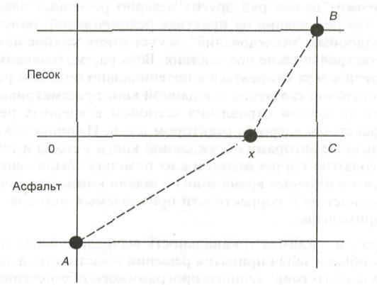
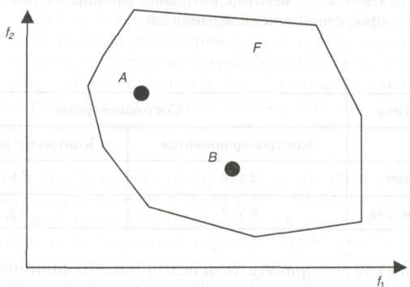
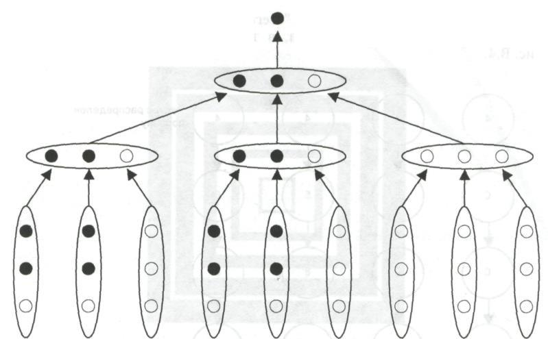
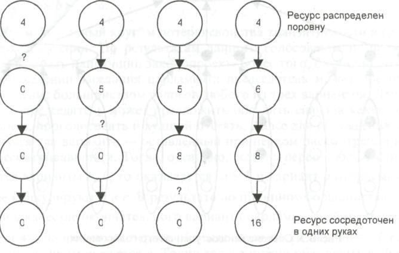

# ПРАКТИЧНА РОБОТА № 1

# МЕТОДИ ПРИЙНЯТТЯ РІШЕНЬ НА ОСНОВІ БІНАРНИХ ВІДНОШЕНЬ ТА ПОПАРНИХ ПОРІВНЯНЬ

**Мета** – ознайомитися з постановками основних задач прийняття рішень; ознайомитися з властивостями бінарних відношень та операцій над ними, набути навичок щодо прийняття рішень на основі заданих відношень; ознайомитися з методикою побудови матриці попарних порівнянь (МПП) в задачах прийняття рішення.

**Завдання для підготовки до виконання роботи:**

**Блок 1. Постановка основних задач прийняття рішень**

1. Сформулювати задачу прийняття рішення вибору оптимального шляху за критерієм мінімізації часу.
2. Описати задачу прийняття рішення вибору параметрів логічної системи за заданими критеріями.
3. Сформулювати задачу прийняття рішення за умови наявності двох альтернатив.
4. Сформулювати задачу прийняття рішення у випадку невизначеності ситуації.
5. Навести варіант постановки задачі прийняття рішення у випадку відсутності числових даних.
6. Описати принципи прийняття рішень для задач, що погано формалізуються.

**Блок 2. Прийняття рішень на основі бінарних відношень**

1. Проаналізувати властивості заданого відношення та з'ясувати, яким воно є: рефлексивним, антирефлексивним, симетричним, антисиметричним, асиметричним, транзитивним. Знайти його найбільший, найменший, максимальний та мінімальний елементи, якщо такі існують, і побудувати обернене й додаткове відношення.
2. Визначити властивості заданого відношення відповідно до заданого варіанта.
3. Проаналізувати отримані результати. Варіанти завдань для виконання роботи наведено в додатку А.

**Блок 3. ПОПАРНІ ПОРІВНЯННЯ В ЗАДАЧАХ ПРИЙНЯТТЯ РІШЕНЬ**

1. Сформулювати задачу, яка моделюється з використанням апарату бінарних відношень (скористатись задачею прийняття рішень, сформульованою в завданні або запропонувати свій варіант). Результати порівнянь між об'єктами подати у вигляді МПП.
2. Використати метод рядкових сум,
3. Перевірити МПП на узгодженість оцінок (перевірка на транзитивність).

Зробити висновки.

**Варіант завдань для виконання роботи до блоку 3:** Згенерувати множину з 5-6 об'єктів (наприклад, перелік предметів, що вивчаються на Вашому курсі). Порівняти їх між собою за привабливістю (значущістю, важливістю і т.д.) методом попарних порівнянь. Результати порівнянь звести у відповідну МПП.

## КОРОТКІ ТЕОРЕТИЧНІ ВІДОМОСТІ

### ПРИЙНЯТТЯ РІШЕНЬ НА ОСНОВІ БІНАРНИХ ВІДНОШЕНЬ

Відношенням R на множині A називається підмножина декартового добутку $\Omega\times\Omega$, тобто $R\subset\Omega^2$. Завдання підмножини $R$ у множині $\Omega\times\Omega$ визначає ті пари елементів, які перебувають у відношенні $R$. Відношення може бути задано переліком пар, за допомогою матриці, графа або розрізів [6] на перетині $i$-го рядка та $j$-го стовпчика.

У разі подання відношення у формі матриці на перетині $i$-го рядка та $j$-го стовпчика ставимо 1, якщо елемент $x_i$ перебуває у відношенні $R$ з елементом $x_j$ і 0 – в інших випадках, тобто

$$
a_{ij}(R)=\begin{cases}1,\ x_iRx_j,\\0,\ \text{в інших випадках}.\end{cases}
$$

**Відношення R1 є включеним до відношення R2 ($R1\le R2$)**, якщо множина пар, для яких виконується відношення $R1$, повністю входить до множини пар, для яких виконується відношення $R2$.

**Відношення R1 є строго включеним до відношення R2 ($R_1<R_2$)**, якщо $R_1\le R_2$ й $R_1\ne R_2$. Рівність відношень реалізується так само, як і рівність множин.

Для матричного задання відношень буде діяти таке правило: якщо $R_1\le R_2$, то $a_{ij}(R_1)\le a_{ij}(R_2)$; $i,j=\overline{1-n}$.

**Відношення $\bar R$ є доповненням до відношення R** тоді і тільки тоді, коли воно покриває виключно ті пари елементів, для яких не виконується відношення $R$, тобто

$$
\bar R=\Omega^2/R, \tag{1.1}
$$

в матричній формі цей запис має вигляд:

$$
a_{ij}(\bar R)=1-a_{ij}(R),\ i,j=\overline{1,n}. \tag{1.2}
$$

**Перетином відношень R1 і R2 ($R_1\cap R_2$)** називається відношення, визначене перетином відповідних підмножин множини $\Omega^2$. У матричній формі запису це подається наступним чином:

$$
a_{ij}(R_1\cap R_2)=\min\{a_{ij}(R_1),a_{ij}(R_2)\},\ i,j=\overline{1,n}. \tag{1.3}
$$

**Об'єднанням відношень R1 і R2 ($R_1\cup R_2$)** називається відношення, отримане шляхом об'єднання відповідних підмножин множини $\Omega^2$. У матричній формі запису це подається наступним чином:

$$
a_{ij}(R_1\cup R_2)=\max\{a_{ij}(R_1),a_{ij}(R_2)\},\ i,j=\overline{1,n}. \tag{1.4}
$$

**Відношення $R^{-1}$ є оберненим до відношення R**, якщо виконується таке співвідношення:

$$
R^{-1}y\Leftrightarrow yRx. \tag{1.5}
$$

У матричній формі запису це подається наступним чином:

$$
a_{ij}(R^{-1})=a_{ji}(R). \tag{1.6}
$$

**Добутком (або композицією) відношень R1 і R2 ($R1\cdot R2$)** називається відношення, що будується за таким правилом: $x(R1\cdot R2)y$, якщо існує такий елемент $z\in\Omega$, для якого справедливі наступні твердження $xR1z$ і $zR2y$. У матричній формі запису це подається наступним чином:

$$
a_{ij}(R_1\cdot R_2)=\max_{k=\overline{1,n}}\min\{a_{ij}(R_1),a_{ij}(R_2)\},\ i,j=\overline{1,n}, \tag{1.7}
$$

де $n$ – порядок матриці.

**Відношення $(R_1,\Omega_1)$ називається звуженням відношення $(R,\Omega)$ на множину 1**, якщо $\Omega_1\subset\Omega$ та $R_1=R\cap\Omega_1\times\Omega_1$. Звуження відношення $(R,\Omega)$ на множину 1 називається також відношенням $R$ на множині $R_1$.

Розглянемо властивості, притаманні відношенням: рефлексивність, антирефлексивність, симетричність, асиметричність, антисиметричність, транзитивність, ациклічність.

**Відношення R називається рефлексивним**, якщо $xRx$ для будь-якого елемента $x\in\Omega$. У матриці рефлексивного відношення на головній діагоналі розміщуються одиниці, тобто елемент матриці $a_{ij}=1$, якщо $i=j$. Граф рефлексивного відношення обов'язково має петлі при вершинах. Стосовно верхнього й нижнього розрізів справедливі твердження: $x\in R^+(x)$, $x\in R^-(x)$ для всіх елементів $x\in\Omega$.

**Відношення R називається антирефлексивним**, коли твердження $xRy$ означає, що $x\ne y\ \forall x\in\Omega$. У матриці антирефлексивного відношення елементи головної діагоналі дорівнюють нулю, тобто $a_{ij}=0$, якщо $i=j$. Граф антирефлексивного відношення не має петель при вершинах, а верхні та нижні розрізи задовольняють таким умовам: $x\notin R^+(x)$, $x\notin R^-(x)$ для всіх елементів $x\in\Omega$. Антирефлексивними будуть відношення «більше», «менше», «бути старшим».

**Відношення R називається симетричним**, якщо $R=R^{-1}(xRy\Rightarrow yRx)$. Матриця симетричного відношення також є симетричною, тобто $a_{ij}=a_{ji}$ для всіх значень $i,j$. У графі такого відношення всі дуги є парними, а верхні й нижні розрізи збігаються для всіх елементів $x\in\Omega$, тобто $R^+(x)=R^-(x)\ \forall x\in\Omega$. Симетричними є, наприклад, відношення рівності.

**Відношення R називається асиметричним**, якщо $R\cap R^{-1}=\varnothing$, тобто якщо з двох виразів ($xRy$ і $yRx$) хоча б один не відповідає дійсності. У матриці симетричного відношення $a_{ij}\land a_{ji}=0$ для всіх значень $i,j$. Інакше кажучи, з двох симетричних елементів ($a_{ij}$ і $a_{ji}$) хоча б один обов'язково дорівнює нулю. Асиметричними є, наприклад, відношення «більше» і «менше». Зауважимо, що антирефлексивність є обов'язковою умовою асиметричності.

**Відношення R називається антисиметричним**, якщо твердження $xRy$ та $yRx$ можуть бути правильними водночас тоді й тільки тоді, коли $x=y$. У матриці антисиметричного відношення $a_{ij}\land a_{ji}=0$, якщо $i\ne j$. Прикладами антисиметричних будуть відношення «більше або дорівнює», «не більше», «не гірше».

**Відношення R називається транзитивним**, якщо $R^2\le R$, тобто якщо з тверджень $xRz$ і $zRy$ випливає, що $xRy$. Транзитивними є відношення «більше або дорівнює», «менше», «бути старшим», «вчитися в одній групі». Зауважимо, що умова $R^2\le R$ надає зручний спосіб перевірки транзитивності відношення в разі, якщо відношення задано за допомогою матриці. Для цього необхідно обчислити матрицю відношення $R^2$, піднісши до квадрата матрицю вихідного відношення і перевірити умову.

Якщо $a_{ij}R^2\le a_{ij}R$ для всіх значень $i,j$, то дане відношення є транзитивним. Якщо ж цю умову порушено хоча б для однієї пари індексів $i,j$, то відношення не буде транзитивним.

**Відношення R називається ациклічним**, якщо $R^k\cap R^{-1}$, тобто якщо з умови $xRz_1,z_1Rz_2,\ldots,z_{k1}Ry$ випливає, що $x\ne y$. Це означає, що граф такого відношення не містить циклів.

Розглянемо процедуру прийняття рішень на основі бінарних відношень. **Елемент $x^*$ множини X будемо називати найкращим з огляду на відношення R**, якщо $x^*Rx$ є справедливим для будь-якого елемента $x$, який належить до множини $X$. **Елемент $x^*\in X$ будемо називати найгіршим з огляду на відношення R**, якщо $xRx^*$ для всіх елементів $x$, які належать до множини $X$. Легко впевнитись, що найкращий і найгірший елементи існують не завжди. Зокрема, вони не будуть існувати, якщо відношення не є повним.

**Елемент $x_{\max}$ називається максимальним за відношенням $R^S$ на множині X**, якщо для будь-якого елемента $x$, який належить до множини $X$, є справедливим твердження $x_{\max}R^Sx$ або елемент $x_{\max}$ є непорівнянним з $x$. Інакше кажучи, не існує елемента (альтернативи) $x\in X$, який був би кращим за альтернативу $x_{\max}$. Множина максимальних з огляду на відношення $R$ елементів множини $X$ позначається як $\max_R X$.

**Елемент $x_{\min}$ називається мінімальним відносно $R^S$ на множині X**, якщо для всіх $x\in X$ або $xR^Sx_{\min}$, або $x$ є непорівнюваним з $x_{\min}$. Отже, не існує елемента $x\in X$, який був би гіршим за $x_{\min}$; немає жодного елемента, над яким би домінував $x_{\min}$. Множина мінімальних з огляду на відношення $R$ елементів множини $X$ позначається як $\min_R X$.

Зауважимо, що якщо найкращі елементи існують, то вони також будуть максимальними, в той час як зворотне твердження не завжди є справедливим.

### ПОПАРНІ ПОРІВНЯННЯ В ЗАДАЧАХ ПРИЙНЯТТЯ РІШЕНЬ

На практиці особа, яка приймає рішення не завжди здатна охарактеризувати окремий об'єкт $a\in A$ чисельним показником, але, якщо до розгляду беруться пари об'єктів, то порівняти їх між собою і визначити, який із них є кращим, тобто має перевагу над іншими, значно легше [7].

Визначити бінарне відношення R означає тим чи іншим способом визначити всі пари об'єктів, для яких бінарне відношення R є справедливим. Існує три способи опису бінарних відношень, а саме: за допомогою графа, у вигляді переліку всіх пар або у вигляді МПП. Елементи МПП визначаються таким чином:

$$
a_{ij}=\begin{cases}0,\ a_i\cong a_j,\\1,\ a_i>a_j,\ a_i,a_j\in A\\-1,\ a_i<a_j.\end{cases}
$$

де $<,>,\cong$ – відношення «краще», «гірше», «однакові».

У теорії обрання та прийняття рішень важлива роль належить відношенню транзитивності, оскільки ця властивість дозволяє представляти природні взаємозв'язки між об'єктами.

Наявність циклічних тріад вказує на непослідовність у твердженнях експертів. Чим менше циклічних тріад має МПП, тим більш послідовними можна вважати судженнях експерта. Матриця називається узгодженою, якщо вона не містить циклічних тріад. Перевірка на транзитивність дозволяє проаналізувати і, у випадку необхідності, скорегувати логіку суджень експерта. Ґрунтуючись на бінарних властивостях, визначених для пар об'єктів, за використання різних методів можна провести ранжирування об'єктів. Одним із підходів до структурування об'єктів є їх ранжирування за методом рядкових сум. Цей метод полягає у визначенні ваг об'єктів $\omega_j=\sum_{i=1}^n a_{ij},\ i,j\in J\{1,n\}$, де $n$ – загальна кількість об'єктів, з наступним відновленням за вагами об'єктів $\omega_j$ їхнього порядку в загальному ранжируванні. При цьому, об'єкту з максимальним значенням відводиться перше місце в ранжируванні, об'єкту з мінімальним значенням – останнє.

## 1. ПОРЯДОК ВИКОНАННЯ ПРАКТИЧНОЇ РОБОТИ

### Блок 1. Постановка основних задач прийняття рішень

Розглянемо деякі постанови основних задач прийняття рішень.

**Задача 1.** Об'єкту необхідно дістатися з пункту А (зупинка автобуса) до пункту В (станція для човнів) (рис. 1.1), подолавши при цьому відстань від пункту А до пункту Х по асфальтовій ділянці (відрізок АХ), а відстань від пункту Х до пункту В – по піщаній (відрізок ХВ). Швидкості пересування на різних ділянках відомі, але відрізняються між собою. В результаті розв'язання задачі необхідно з'ясувати, де доцільно перейти з однієї ділянки на іншу, щоб найшвидше дістатися до кінцевої точки.

*Рисунок 1.1 – Вибір об'єктом оптимального шляху*

Сформульовану задачу можна розглядати як задачу прийняття рішення щодо обрання однієї з множина альтернатив, кожна з яких характеризується точкою прямої ОС, де проходить маршрут, тобто числом х. Кожному рішенню відповідає результат, тобто маршрут від А до В, який оцінюється числом – часом пересування. Таким чином, маємо задачу прийняття рішення в **умовах визначеності**.

**Задача 2.** Проектувальнику логічних електронних схем, які характеризуються двома показникам – потужністю споживання ($f_1$) і часом затримки розповсюдження сигналу ($f_2$) – необхідно розробити таку схему, яка б за умови виконання функціональних вимог мала мінімальні значення обох показників. При цьому можна варіювати параметрами (номіналами) резистивних елементів схеми $R_1,\ldots,R_L$ в заданих межах, де кожному фіксованому набору $R=(R_1,\ldots,R_L)$ параметрів відповідають певні значення $f_1$ і $f_2$. Таким чином, якщо взяти за альтернативу набори значень $R$, а в якості результату розглядати пари чисел ($f_1,f_2$), що їм відповідають, то можна прийти до задачі обрання рішення **в умовах визначеності**.

Відобразивши всі можливі пари чисел ($f_1,f_2$) на площині, одержимо деяку область $F$, кожна точка якої являє собою один із можливих результатів (рис. 1.2).

*Рисунок 1.2 – Область можливих результатів F*

Оскільки для прийняття рішень в умовах визначеності обрання альтернативи рівнозначно обранню результату, то остаточне рішення приймається на основі обрання певної точки із множини $F$. Отже необхідно визначити, яка точка буде оптимальною в такому випадку.

Ця задача є більш складною через наявність двох критеріїв для прийняття рішення. Наприклад, у точці А (рис. 1.2) значення критерію $f_1$ є кращим (меншим), ніж значення в точці В, але в точці В кращим є значення критерію $f_2$. Яку з альтернатив обрати? В задачах такого типу питання не стільки в тому, як знайти оптимальне рішення, скільки в тому, що розуміти під оптимальністю. Мова йде про складності не технічного, а концептуального характеру.

**Задача 3.** Пасажир трамвая намагається прийняти рішення про те, купувати йому квиток чи ні. Результат визначається двома подіями: рішенням пасажира й фактом появи контролера. Таким чином, пасажир виступає як особа, що приймає рішення (ОПР), а факт появи контролера як середовище. У даному випадку можна виділити дві альтернативи в прийнятті рішення й два стани середовища. Необхідно якимось чином кількісно оцінити «корисність» результатів. Простіш за все в якості оцінок розглядати виражені в умовних одиницях грошові втрати в разі настання можливих подій (табл.1.2).

<table>
<thead>
<tr><th rowspan="2">Альтернатива</th><th colspan="2">Стан середовища</th></tr>
<tr><th>Контролер з'явиться</th><th>Контролер не з'явиться</th></tr>
</thead>
<tbody>
<tr><td>Брати квиток</td><td>15 грн</td><td>15 грн</td></tr>
<tr><td>Не брати квитка</td><td>100 грн + 15 грн</td><td>0 грн</td></tr>
</tbody>
</table>

*Таблиця 1.2 – Грошові оцінки альтернатив у разі настання можливих подій*

Рішення приймається з метою мінімізації втрат і є прикладом задачі прийняття рішень **в умовах невизначеності**.

Методи розв'язання подібних задач істотно залежать від наявності додаткової інформації, наприклад, від імовірності настання відповідних подій. Принциповим є також питання про те, одноразовим чи багаторазовим є обрання рішення.

**Задача 4.** За результатами розслідування злочину заарештовано двох підозрюваних. Слідство не виявило незаперечних доказів їх провини. Отже, результати розгляду судової справи повністю залежать від стратегії поведінки підозрюваних. Кожен із них має дві альтернативи — зізнатися в здійсненні злочину або все заперечувати. Так звана дилема ув'язненого. Можливі результати розвитку подій для кожної альтернативи наведені в табл.1.3 (ЗП – заперечення провини, ВП – визнання провини; 1,2 – номери затриманих).

<table>
<thead>
<tr><th rowspan="2">Альтернативи</th><th colspan="2">(1, 2)</th></tr>
<tr><th>ЗП</th><th>ВП</th></tr>
</thead>
<tbody>
<tr><td>ЗП</td><td>(1,1)</td><td>(10,0)</td></tr>
<tr><td>ПВ</td><td>(0,10)</td><td>(7,7)</td></tr>
</tbody>
</table>

*Таблиця 1.3 – Результати розвитку подій для кожної альтернативи*

Таблиця інтерпретується так. Якщо обидва підозрюваних не зізнаються, то обом буде пред'явлене обвинувачення в здійсненні незначного злочину з подальшим позбавленням волі на один рік. Якщо один з них зізнається, а другий - ні, то перший за видачу спільника й допомогу слідству буде звільнений від відповідальності, а другий одержить 10 років позбавлення волі. Якщо ж обидва зізнаються, то зазнають кари, але за щире зізнання термін ув'язнення буде зменшений до семи років кожному. Яке рішення варто прийняти кожному з підозрюваних, щоб мінімізувати покарання?

У цьому випадку на відміну від «природної» невизначеності або невизначеності середовища попереднього завдання, спостерігається невизначеність типу «контрагент». Ефективність рішення при цьому істотно залежить від стратегії поведінки другої особи, а також від інформованості обох суб'єктів про наміри іншої сторони.

**Задача 5.** У багатьох випадках ОПР може вказати множину всіх пар результатів, для яких перший результат у парі має перевагу над іншим. При цьому будь-які кількісні оцінки результатів у принципі не проводяться. Наприклад, молодий учений обирає місце своєї майбутньої роботи з такої множини альтернатив:

1) $x_1$: асистент у відомому університеті з окладом 250 у.о.
2) $x_2$: доцент в електротехнічному інституті з окладом 350 у.о.
3) $x_3$: професор у маловідомому периферійному інституті з окладом 450 у.о.

Можна уявити собі ситуацію, коли вчений віддає перевагу альтернативі $x_1$ у порівнянні з альтернативою $x_2$, розсудивши, що престиж відомого університету й контакти з провідними фахівцями даної галузі варті 100 у.о. Дану перевагу можна позначити таким чином $(x_1,x_2)$ тобто $x_1>x_2$ ($x_1$ краще за $x_2$). Також можна припустити, що $x_2>x_3$. Водночас, порівнюючи альтернативи $x_1$ і $x_3$, доцільно зробити вибір на користь альтернативи $x_3$ у порівнянні з альтернативою $x_1$, (через велику різницю в окладі). Таким чином, система переваг задається множиною пар: $(x_1,x_2),(x_2,x_3),(x_3,x_1)$, серед яких неможливо обрати найкращу альтернативу. Якими принципами варто керуватися для прийняття рішень у таких ситуаціях?

**Задача 6.** Окремий клас практичних задач становлять **задачі прийняття рішень, які погано формалізуються** через те, що не мають адекватного традиційного математичного опису. У якості прикладу можна навести задачі медичної діагностики, де на основі вихідної інформації (результатів аналізів, симптомів хвороби) необхідно прийняти рішення щодо визначення типу захворювання. Такі задачі можуть розв'язуватись шляхом застосування спеціальних програмних комплексів — експертних систем, під час проектуванні яких використовуються методи інтелектуального аналізу даних.

Важливе значення в експертних системах прийняття рішень мають методи побудови бази знань для конкретної (звичайно досить вузької) предметної галузі й процедури формування логічного висновку (правил), що дозволяють прийняти рішення на основі вихідних фактів або тверджень.

Характерним прикладом таких правил можуть служити вирази типу «ЯКЩО (умова), ТО (дія)», наприклад:

**якщо** x любить тепло, **то** x подобається в Таїланді.

Зазначений формат запису знань характерний для класу продукційних експертних систем.

**Задача 7.** Основне завдання систем прийняття рішення в **задачах групового вибору** полягає в тому, щоб обрати «справедливі» принципи обліку індивідуальних виборів, що в подальшому дозволять дійти доцільного суспільного (або групового) рішення. Як змістовний приклад можна привести засідання військової ради, коли кожний учасник засідання висловлює свою думку щодо плану проведення майбутньої операції, а в остаточному підсумку обирається один оптимальний варіант, який є результатом колегіального обговорення членів ради. Як це зробити? Який результат вибору вважати «гарним», які риси повинні бути йому притаманні? Як і в задачі 2, в першу чергу виникають концептуальні труднощі, тобто спочатку потрібно визначити, яким критеріям повинен задовольняти розумний результат погоджень індивідуальних переваг.

Розглянемо постановку задачі на основі простої **моделі групового вибору**. Нехай є множина варіантів рішень X: $X=\{x_1,x_2,\ldots,x_m\}\ldots$ і група з $n$ членів, що приймають рішення. Кожний член групи з номером $i=1,\ldots,n$ має свою систему переваг на множині X, що задається бінарним відношенням $R_i\subset X\times X$,

$$
R_i=\{(x_j,x_k),\ldots,(x_p,x_m)\},
$$

де $R_i$ — множина впорядкованих пар елементів з X, причому включення деякої пари $(x_s,x_t)$ до множини $R_i$, означає, що з позиції $i$-го члена групи варіант $x_s$ є кращим за варіант $x_t$: $x_s>x_t$. За заданою системою $R_1,\ldots,R_n$ індивідуальних переваг необхідно побудувати групову (колективну) систему переваг $R=f(R_1,\ldots,R_n)$, де $f$ — деяка функція, що реалізує прийнятий принцип узгодження індивідуальних переваг.

Цілком логічно використовувати очевидне правило більшості (що звичайно й відбувається на практиці за колективного вирішенні проблем), однак існують певні труднощі, пов'язані з природними принципами узгодження, типу правила більшості або оцінювання за середнім балом. Розглянемо добре відомі парадокси голосування.

Нехай три парламентські групи, що мають приблизно однакову кількість голосів, обговорюють три варіанти деякого законопроекту **a, b, c** з метою затвердження одного «найкращого» варіанта. Системи переваг груп мають відповідно такий вигляд:

$a>b>c,\ R_1=\{(a,b),(b,c),(a,c)\};$
$b>c>a,\ R_2=\{(b,c),(c,a),(b,a)\};$
$c>a>b,\ R_3=\{(c,a),(a,b),(c,b)\}.$

Вирішено діяти за правилом більшості. Тоді в результаті голосування буде одержано $a>b$, оскільки пари $(a,b)$ є присутніми в $R_1$ і $R_3$, а пари $(b,a)$ – тільки в $R_2$. Аналогічно буде встановлено, що $b>c$ і $c>a$, тобто $a>b>c>a$. Одержано «порочне коло» і втрата властивості транзитивності в груповій перевазі. За результатами даного голосування як і раніше не можна обрати найкращий законопроект. Більше того, за вмілого ведення засідання парламенту голова може забезпечити прийняття більшістю голосів кожного з трьох варіантів. Дійсно, голова може запропонувати обговорити спочатку два певних варіанти, проголосувати й відмовитись від гіршого з них. Для подальшого обговорення знову залишиться два варіанти – обраний під час першого розгляду й той, що не розглядався. Тобто, якщо на перше обговорення виносяться варіанти a і b, то a>b і варіант b відкидається. Далі конкурують a і c. У результаті, за принципом більшості виявляється, що c>a, а отже як остаточний варіант парламент обирає варіант с.

Якщо ж на перше обговорення винести варіанти b і c, то в результаті найкращим виявиться варіант a. Аналогічно можна забезпечити вибір варіанта b у якості найкращого. Отже, безневинна, на перший погляд, пропозиція щодо порядку розгляду впливає на результат!

Розглянемо постановку задачі **виборів президента** (парадокс багатоступінчастого голосування). Припустимо, що на виборах президента деякої компанії (або держави) борються дві партії, які намагаються зробити переможцем свого представника. За вмілого ведення справи меншість може нав'язати свою думку більшості, хоча голосування буде проводитися за правилом більшості.

Із рисунка 1.3 видно, що група, яка мала вісім голосів, у результаті нав'язала свою думку групі з дев'ятнадцяти виборців. Уся справа, звичайно, полягає в умілому групуванні сил. Але за допомогою сучасних виборчих технологій це можна реалізувати, що робиться повсюдно шляхом цілеспрямованого використання засобів, організації агітаційних поїздок у відповідні регіони тощо. Як показав аналіз, декілька президентів США дійсно представляли меншість виборців, але в результаті реалізації системи багаторівневого голосування, отримали перемогу. До цього ж, чим більше рівнів, тим яскравіше проявляється зазначений ефект.

*Рисунок 1.3 – Схематичне зображення процесу багаторівневого голосування*

Розглянемо постановку задачі **розподілу ресурсів**. Нехай деякий ресурс (наприклад, грошовий) розподілений між n членами деякого співтовариства. При цьому станом співтовариства (системи) будемо називати вектор $(a_1,a_2,\ldots,a_n)$, де $a_i$,— об'єм ресурсу, яким володіє $i$-й член співтовариства. Загальний об'єм ресурсу постійний і складає:

$$
a=\sum_{i=1}^{n}a_i.
$$

Розглянемо інший стан тієї ж самої системи $b=(b_1,b_2,\ldots,b_n)\ldots$ Очевидно, що стан $b$ є не гіршим за стан $a$ для $i$-го суб'єкта, якщо $b_i\ge a_i$. Здійснимо перерозподіл ресурсів на основі переважної більшості: перехід системи з деякого стану a в деякий стан b дозволений, якщо новий стан буде не гіршим за старий для всіх членів співтовариства, крім, хіба що, одного (тотально-мажоритарне правило). Послідовність станів $a_1,a_2,\ldots,a_n$ будемо називати тотально-мажоритарним шляхом з $a_1$ в $a_m$, якщо кожний проміжний перехід з $a_i$ в $a_{i+1}$ було здійснено на основі тотально-мажоритарного правила. Досить несподіваним є твердження про те, що тотально-мажоритарний шлях може пов'язувати будь-які два стани системи.

Таким чином, спираючись на думку «всього суспільства» можна робити будь-які перерозподіли ресурсу, в тому числі й наведені на рисунку 1.4.

*Рисунок 1.4 – Перерозподіл ресурсу за принципом більшості*

Наведені приклади не вичерпують всіх типів задач теорії прийняття рішень, але надають можливість скласти уявлення про те, як часто в повсякденному житті ми стикаємось з задачами такого типу.

### Блок 2. Прийняття рішень на основі бінарних відношень

Розглянемо порядок проведення обчислень на прикладах.

**Задача 1.** Для відношення R, заданого на множині $X=\{x_1,x_2,x_3,x_4\}$ матрицею

$$
R=\begin{pmatrix}1&1&0&1\\0&1&1&1\\0&1&0&0\\1&0&1&0\end{pmatrix}
$$

необхідно побудувати обернене до нього відношення та доповнення.

За визначенням доповнення (1.1) – (1.2) відношення $\bar R$ можна задати матрицею

$$
\bar R=\begin{pmatrix}0&0&1&0\\1&0&0&0\\1&0&1&1\\0&1&0&1\end{pmatrix}
$$

Обернене відношення $R^{-1}$, за визначенням (1.5), матиме вигляд

$$
R^{-1}=\begin{pmatrix}1&0&0&1\\1&1&1&0\\0&1&0&1\\1&1&0&0\end{pmatrix}
$$

**Задача 2.** Визначити композицію відношень $R_1$ і $R_2$, заданих на множині $X=\{x_1,x_2,x_3,x_4\}$ матрицями

$$
R_1=\begin{pmatrix}1&1&1&1\\0&1&1&1\\0&1&0&0\\1&0&1&0\end{pmatrix},\quad
R_2=\begin{pmatrix}0&1&0&1\\0&0&0&1\\0&1&0&0\\0&0&1&0\end{pmatrix}
$$

За визначенням композиції в матричній формі (1.7), композиція відношень обчислюється як максимінний добуток відповідних матриць.

$$
R_1\cdot R_2=\begin{pmatrix}1&1&1&1\\0&1&1&1\\0&1&0&0\\1&0&1&0\end{pmatrix}\cdot\begin{pmatrix}0&1&0&1\\0&0&0&1\\0&1&0&0\\0&0&1&0\end{pmatrix}=\begin{pmatrix}0&1&1&1\\0&1&1&1\\0&0&0&0\\0&1&0&0\end{pmatrix}
$$

**Задача 3.** Визначити властивості такого відношення:

$$
R=\begin{pmatrix}1&1&1\\0&1&0\\1&0&1\end{pmatrix}
$$

Дане відношення є рефлексивним, оскільки на головній діагоналі його матриця розташовані тільки одиниці; воно не є симетричним, оскільки серед симетричних елементів є такі, що не дорівнюють один одному, наприклад, елементи $a_{12}$ і $a_{21}$. Оскільки елемент $a_{13}=a_{31}$, то відношення не є ані асиметричним, ані антисиметричним.

Для перевірки його транзитивності помножимо дане відношення саме на себе, тобто

$$
R^2=\begin{pmatrix}1&1&1\\0&1&0\\1&0&1\end{pmatrix}\cdot\begin{pmatrix}1&1&1\\0&1&0\\1&0&1\end{pmatrix}=\begin{pmatrix}1&1&1\\0&1&0\\1&1&1\end{pmatrix}
$$

$R^2\not\subset R$, а отже, вихідне відношення не є транзитивним.

**Задача 4.** Визначити максимальні, мінімальні, найбільші і найменші елементи відношення R, заданого на множині $X=\{x_1,x_2,x_3,x_4\}$, якщо

$$
R=\begin{pmatrix}1&0&1&0\\1&1&0&0\\1&0&1&1\\1&0&0&1\end{pmatrix}
$$

Дивлячись на матрицю, робимо висновок про те, що відношення не має найкращих елементів, оскільки жодному елементу не відповідає рядок, який містить тільки одиниці; найгіршим елементом є елемент $x_1$, оскільки він гірший від будь-якого елемента (відповідний йому стовпчик містить тільки одиниці).

Для визначення максимальних і мінімальних елементів побудуємо строге відношення, відповідне даному, тобто

$$
R^S=\begin{pmatrix}0&0&0&0\\1&0&0&0\\0&0&0&1\\1&0&0&0\end{pmatrix}
$$

Дивлячись на матрицю, робимо висновок про те, що максимальними будуть елементи $x_2$ і $x_3$ (відповідні стовпчики містять тільки нулі), мінімальним – елемент $x_1$ (відповідний стовпчик складається тільки з нулів).

Таким чином, вихідне відношення не має найкращих елементів, має один найгірший (він же мінімальний) елемент і два максимальні елементи.

### Блок 3. Попарні порівняння в задачах прийняття рішень

**Задача 1.** Визначити складові здорового способу життя та встановити ранг кожного з них в переліку.

Використати для цього згенеровану множину факторів, що впливають на здоровий спосіб життя (табл.4.1).

| Опис фактору здорового способу життя | Позначення фактора |
|---|---|
| Харчування | $a1$ |
| Фізична активність | $a2$ |
| Загартування | $a3$ |
| Позитивні емоції | $a4$ |
| Відмова від шкідливих звичок | $a5$ |
| Розвиток духовності | $a6$ |

*Таблиця 4.1 – Фактори здорового способу життя та їх позначення*

Порівняти фактори між собою за ступенем значущості та подати результати порівнянь у формі відповідної МПП (табл.4.2), де значення кожної комірки формується умовами (4.1). Додати стовпчик для підрахунку рядкових сум.

Заповнюється лише верхня трикутна частина матриці, а нижня віддзеркалюється відносно її головної діагоналі.

| Фактори | $a1$ | $a2$ | $a3$ | $a4$ | $a5$ | $a6$ | $\sum_{i=1}^{n}a_i$ |
|---|---|---|---|---|---|---|---|
| $a1$ | 0 | -1 | -1 | 1 | 1 | 0 | 0 |
| $a2$ | 1 | 0 | 1 | 0 | -1 | 1 | 2 |
| $a3$ | 1 | -1 | 0 | 1 | 1 | -1 | 1 |
| $a4$ | -1 | 0 | -1 | 0 | 1 | -1 | -2 |
| $a5$ | -1 | 1 | -1 | -1 | 0 | 1 | -1 |
| $a6$ | 0 | -1 | 1 | 1 | -1 | 0 | 0 |

*Таблиця 4.2 – МПП з даними для виконання порівняння*

Виконати ранжирування факторів від більшого до меншого і виділити найбільш значущий фактор методом рядкових сум (табл.4.3).

| Фактор | | Ранг |
|---|---|---|
| $a2$ | Фізична активність | 2 |
| $a3$ | Загартування | 1 |
| $a1$ | Харчування | 0 |
| $a6$ | Розвиток духовності | 0 |
| $a5$ | Відмова від шкідливих звичок | -1 |
| $a4$ | Позитивні емоції | -2 |

*Таблиця 4.3 – Ранжирування факторів від більшого до меншого*

Ранжирування можна також записати таким чином:

$$
a2>a3>a1\cong a6>a5>a4.
$$

Оцінити узгодженість експертних оцінок або транзитивність відношень за матрицею, тобто перевірити можливі комбінації відношень на трьох об'єктах за ознакою транзитивності.

Оскільки МПП заповнюється дзеркально-протилежно, то достатньо виконати цю операцію для верхньої трикутної частини. Представимо процес перевірки у вигляді таблиці 4.4.

| № з/п | Об'єкти | Умова транзитивності | Відношення | Примітка |
|---|---|---|---|---|
| 1 | 2 | 3 | 4 | 5 |
| 1 | $a_1,a_2,a_3$ | $a_1<a_2,\ a_2>a_3$ | транзитивність не може бути перевіреною | |
| 2 | $a_1,a_2,a_4$ | $a_1<a_2,\ a_2\cong a_4$ | транзитивність не може бути перевіреною | |
| 3 | $a_1,a_2,a_5$ | $a_1<a_2,\ a_2<a_5$ | $a_1<a_5,\ a_1>a_5$ | – |
| 4 | $a_1,a_2,a_6$ | $a_1<a_2,\ a_2>a_6$ | транзитивність не може бути перевіреною | |
| 5 | $a_1,a_3,a_4$ | $a_1<a_3,\ a_3>a_4$ | транзитивність не може бути перевіреною | |
| 6 | $a_1,a_3,a_5$ | $a_1<a_3,\ a_3>a_5$ | транзитивність не може бути перевіреною | |
| 7 | $a_1,a_3,a_6$ | $a_1<a_3,\ a_3<a_6$ | $a_1<a_6,\ a_1\cong a_6$ | – |
| 8 | $a_1,a_4,a_5$ | $a_1>a_4,\ a_4>a_5$ | $a_1>a_5,\ a_1>a_5$ | + |
| 9 | $a_1,a_5,a_6$ | $a_1>a_5,\ a_5>a_6$ | $a_1>a_6,\ a_1\cong a_6$ | – |
| 10 | $a_2,a_3,a_4$ | $a_2>a_3,\ a_3>a_4$ | $a_2>a_4,\ a_2\cong a_4$ | – |
| 11 | $a_2,a_3,a_5$ | $a_2>a_3,\ a_3>a_5$ | $a_2>a_5,\ a_2<a_5$ | – |
| 12 | $a_2,a_3,a_6$ | $a_2>a_3,\ a_3<a_6$ | транзитивність не може бути перевіреною | |
| 13 | $a_2,a_4,a_5$ | $a_2\cong a_4,\ a_4<a_5$ | транзитивність не може бути перевіреною | |
| 14 | $a_2,a_4,a_6$ | $a_2\cong a_4,\ a_4<a_6$ | транзитивність не може бути перевіреною | |
| 15 | $a_2,a_5,a_6$ | $a_2<a_5,\ a_5<a_6$ | транзитивність не може бути перевіреною | |
| 16 | $a_3,a_4,a_5$ | $a_3>a_4,\ a_4>a_5$ | $a_3>a_5,\ a_3<a_5$ | + |
| 17 | $a_3,a_4,a_6$ | $a_3>a_4,\ a_4<a_6$ | транзитивність не може бути перевіреною | |
| 18 | $a_3,a_5,a_6$ | $a_3>a_5,\ a_5>a_6$ | $a_3>a_6,\ a_3<a_6$ | – |
| 19 | $a_4,a_5,a_6$ | $a_4>a_5,\ a_5>a_6$ | $a_4>a_6,\ a_4<a_6$ | – |

*Таблиця 4.4 – Перевірка узгодженості експертних оцінок за матрицею*

Перевірка на транзитивність показала, що у семи випадках із дев'яти можливих для перевірки транзитивність було порушено. Отже, можна дійти висновку, що експерт у своїх оцінках був непослідовним.

## Контрольні запитання

1. Як приймаються рішення у випадку визначеності?
2. Як враховуються стан середовища і контрагент в разі прийняття рішення в умовах невизначеності?
3. Яку роль відіграють системи переваг у разі прийняття рішень?
4. Сформулювати принципи прийняття рішень у погано формалізованих задачах.
5. В яких випадках у разі прийняття рішень використовуються експертні методи?
6. Як приймаються групові рішення?
7. Дати визначення бінарного відношення.
8. Які існують способи завдання відношень?
9. Яким чином можна задати відношення за допомогою матриці?
10. Як можна задати відношення у вигляді графа?
11. Як можна задати відношення за допомогою розрізів?
12. Сформулювати визначення верхнього (нижнього) розрізу відношення.
13. Які зі способів завдання відношень можна використовувати на нескінченній множині елементів?
14. Які математичні операції виконуються над відношеннями?
15. Яке відношення називається рефлексивним (анти рефлексивним)?
16. Які відношення називаються симетричними, антисиметричними, асиметричними?
17. Які відношення називають транзитивними, сильно транзитивними, від'ємно транзитивними?
18. Яким чином обчислюється транзитивне замикання відношення?
19. Які властивості є характерними для відношення переваги?
20. Дати визначення найкращого (найгіршого) елемента множини.
21. Який елемент множини називається мінімальним (максимальним) за даним відношенням переваги?
22. Які властивості бінарних відношень є найбільш важливими для здійснення аналізу МПП?
23. В яких випадках спостерігається нетранзитивність елементів матриці бінарних відношень? Яким чином вона перевіряється?
24. Яким чином здійснюється ранжирування факторів за МПП?
