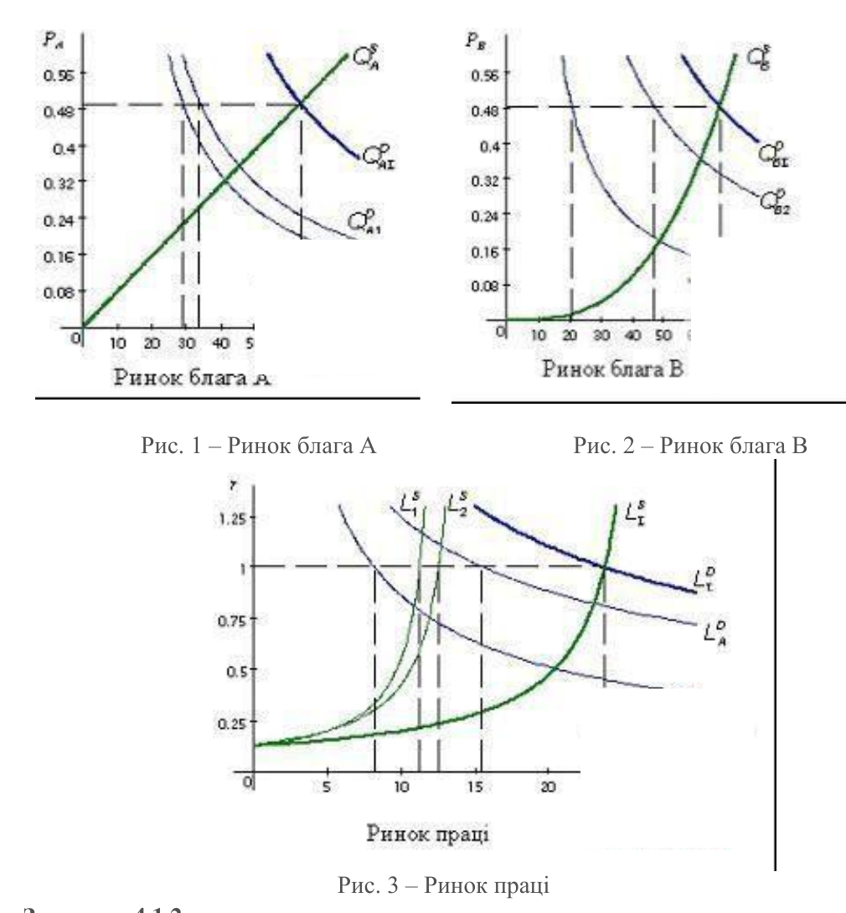
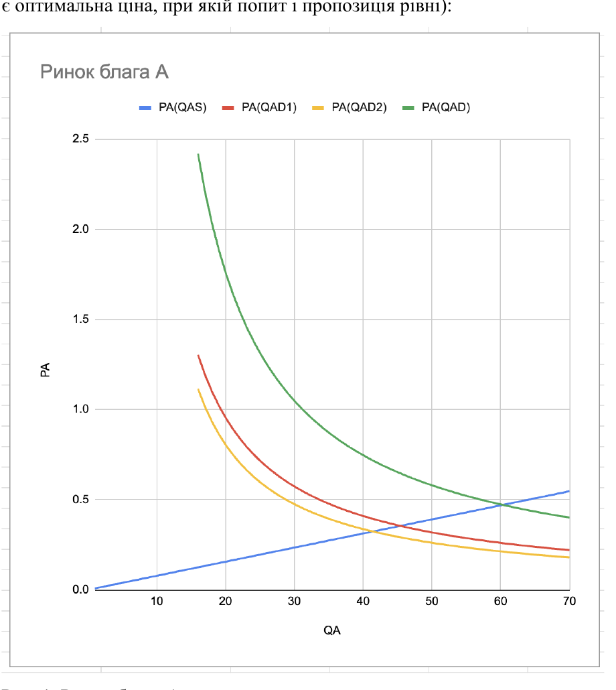
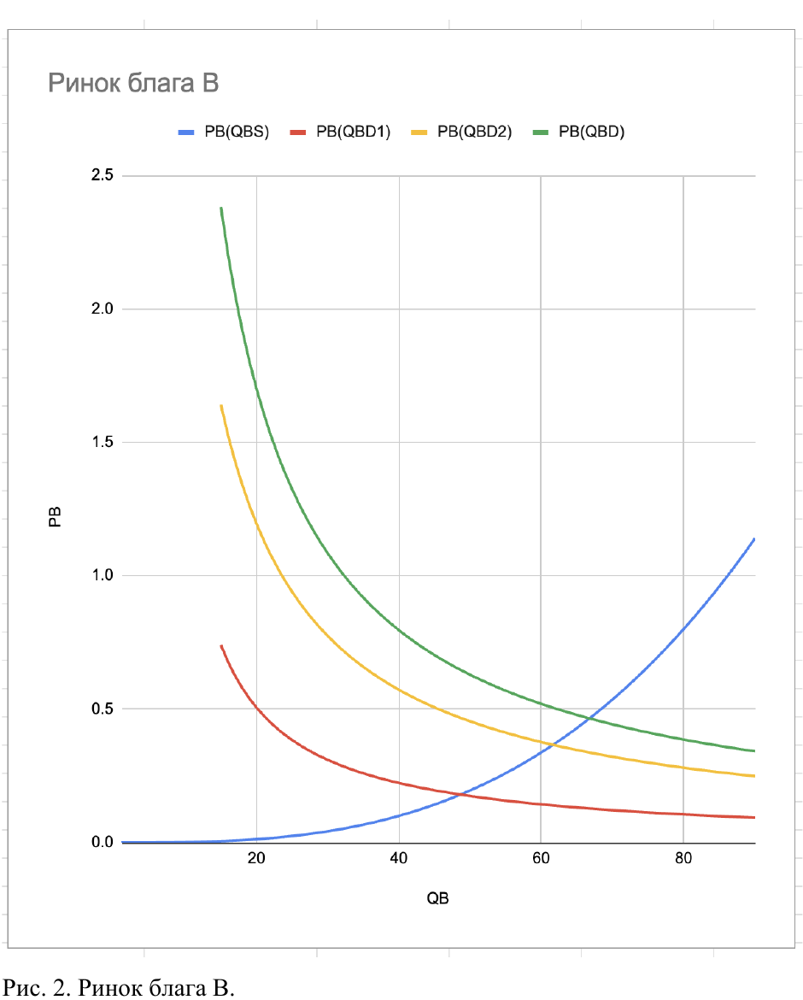
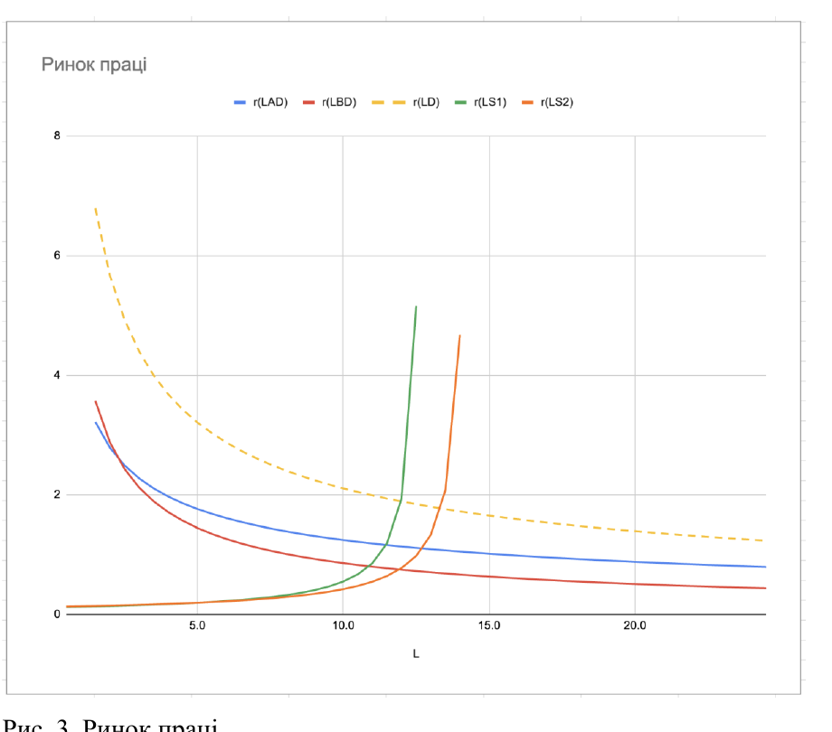
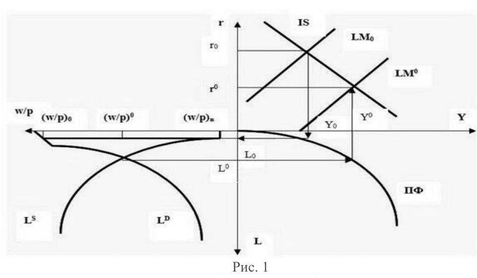
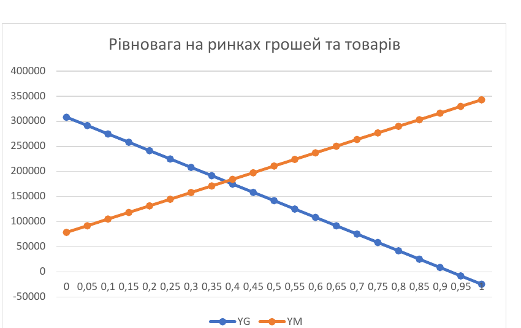
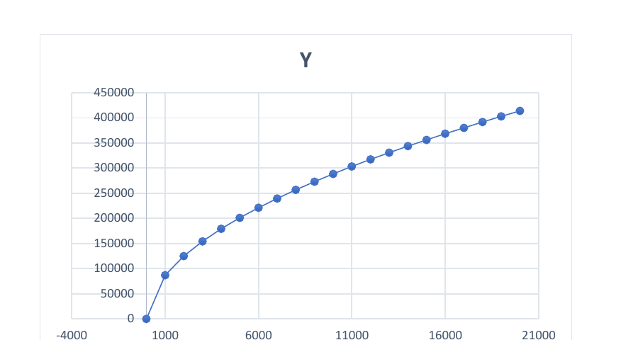
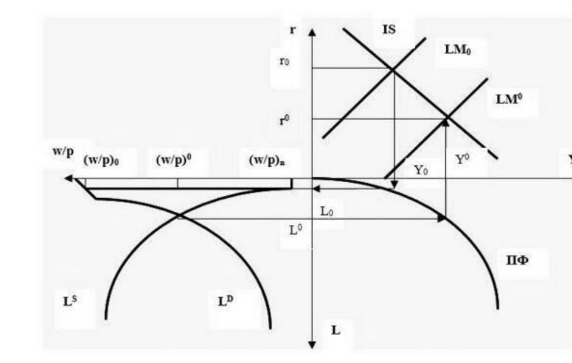
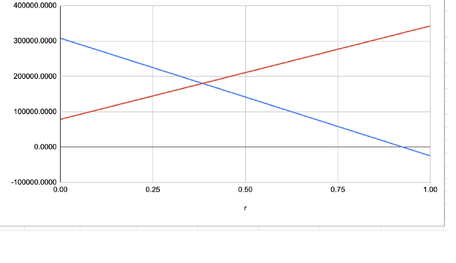
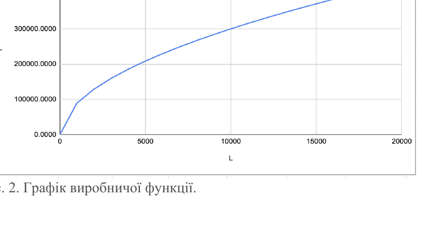

# ЛАБОРАТОРНА РОБОТА №4

# Моделювання економічної рівноваги: підходи Вальраса і Кейнса

**Мета:** отримати навички роботи з моделлю Вальраса та набути навички застосування моделі Кейнса до дослідження економіки та економічних процесів.

**Примітка:**

- Усі розрахунки і графіки виконувати в Excel у файлі *Lab№1-В№-Prizviche*.
- Звіт оформити як документ MS Word з ім’ям *Lab№1-В№-Prizviche*, зберегти обидва файли у папці МЕ своєї папки.

## Блок 4.1. Модель Вальраса та її застосування до дослідження конкурентної ринкової рівноваги

### Завдання 1. Завдання 4.1.1

Для наведеного прикладу побудувати модель Вальраса конкурентної рівноваги в Excel та провести дослідження моделі.

**Приклад.** Економіка складається з:

- двох домашніх господарств, які споживають два блага (А та В);
- двох фірм, одна з яких виробляє благо А, а друга — благо В. Відповідно будемо позначати ці фірми як А та В.

Господарювання ведеться в умовах досконалої конкуренції, тому кожний з учасників сприймає ціни як екзогенні параметри.

Переваги домашніх господарств відносно споживаних благ і вільного часу (а відповідно, праці) відображаються їх функціями корисності:

$$
U_1=(Q_{A1}-10)^{0.5}(Q_{B1}-6)^{0.3}(16-L_1)^{0.2};
$$

$$
U_2=(Q_{A2}-8)^{0.3}(Q_{B2}-4)^{0.6}(16-L_2)^{0.1}.
$$

Доходи (бюджети) домашніх господарств складаються з їх заробітної платні і прибутку фірм, який цілком сплачується власникам капіталу, тобто домашнім господарствам. Таким чином, прибуток являє собою оплату послуг капіталу ($p=r_kK$), економічний прибуток через умови досконалої конкуренції дорівнює нулю.

Будемо вважати, що 1-му домашньому господарству належить увесь капітал, який використовує фірма А, а 2-му домашньому господарству — увесь капітал, який використовує фірма В. Тоді бюджетні рівняння домашніх господарств матимуть вигляд:

$$
P_AQ_{A1}+P_BQ_{B1}=\pi_A+rL_1;
$$

$$
P_AQ_{A2}+P_BQ_{B2}=\pi_B+rL_2.
$$

Технологія виробництва благ задана виробничими функціями короткого періоду

$$
Q_A=16L_A^{0.5};\qquad Q_B=40L_B^{0.25}.
$$

Виходячи з наведених вище даних та теоретичних знань, можна знайти вектор рівноважних цін і на його основі визначити всі результати функціонування даної економіки:

1. обсяги виробництва кожного блага і пропозиції благ;
2. доходи, обсяги і структуру споживання кожного домашнього господарства;
3. обсяги попиту на працю кожної фірми;
4. якість пропозиції праці кожним домашнім господарством.

Результати господарювання при таких цінах навести (виконати необхідні обчислення в Excel та побудувати графіки) у табл. 1 та табл. 2, а також на рис. 1, рис. 2, рис. 3.

<table>
<caption><strong>Таблиця 1. Виробництво і споживання благ</strong></caption>
<thead><tr><th rowspan="2">Благо</th><th rowspan="2">Вироблено, шт.</th><th rowspan="2">Використано праці, год.</th><th rowspan="2">Створено прибуток, грош. од.</th><th colspan="2">Спожито, шт., споживачем</th></tr><tr><th>1-м</th><th>2-м</th></tr></thead>
<tbody>
<tr><th>А</th><td>63,1</td><td>15,5</td><td>15,6</td><td>34,0</td><td>29,1</td></tr>
<tr><th>В</th><td>67,7</td><td>8,2</td><td>24,5</td><td>20,7</td><td>47,0</td></tr>
</tbody></table>

<table>
<caption><strong>Таблиця 2. Доходи і витрати домашніх господарств, грош. од.</strong></caption>
<thead><tr><th rowspan="2">Споживач</th><th colspan="3">Доходи</th><th colspan="3">Витрати на благо</th></tr><tr><th>Зарплата</th><th>Прибуток</th><th>Всього</th><th>А</th><th>В</th><th>Всього</th></tr></thead>
<tbody>
<tr><th>1-й</th><td>11,2</td><td>15,6</td><td>26,8</td><td>16,8</td><td>10,0</td><td>26,8</td></tr>
<tr><th>2-й</th><td>12,5</td><td>24,5</td><td>37,0</td><td>14,3</td><td>22,7</td><td>37,0</td></tr>
</tbody></table>



*Рис. 1 — Ринок блага А. Рис. 2 — Ринок блага В. Рис. 3 — Ринок праці.*

### Завдання 4.1.2

Захистіть виконану роботу, представивши результати роботи та відповівши на запитання викладача з наведеного переліку.

## Короткі теоретичні відомості

До складу сучасної розвинутої економіки входять численні господарські одиниці та споживачі. Кожний із цих учасників ринку досконалої конкуренції має свої цілі, що уможливлює наявність конфліктних ситуацій. Та щоб економічна система функціонувала нормально, індивідуальні дії різних учасників повинні бути відносно добре узгодженими.

У моделі Вальраса, що включає скінчену кількість споживачів і виробників, таке вирішення (подолання) конфлікту досягається не втручанням держави, а опосередковано, через конкретний ринковий механізм, що ґрунтується на регулюючій дії системи цін. Якщо система цін визначена, то будь-яка ринкова угода незалежно від того, чи є ринок конкурентним, чи ні, здійснюється відповідно до цієї системи цін.

Якщо учасники не можуть впливати на ціни, то ринок називають конкурентним. На конкурентному ринку ціни для кожного з учасників є некерованими, і їм залишається лише пристосовуватися до існуючої системи цін.

Основна ідея Вальраса полягає у тому, щоб за певної системи цін індивідуальні плани (наміри) учасників стали спільними, тобто така система цін забезпечує розподіл ресурсів і продукції на основі розв’язання конфлікту між учасниками. Таку рівноважну ситуацію називають конкурентною рівновагою.

У даній моделі поняття «товар» трактується розширено. Під товаром маються на увазі і предмет (продукт праці), і засіб праці (капітальне обладнання, споруди тощо), і первинні ресурси (праця та природні ресурси).

Таким чином, конкурентна рівновага являє собою сумісний розподіл виробництва та споживання, а сукупний попит у цьому разі не перевищує сукупної пропозиції. Вартість сукупного попиту в конкурентних цінах дорівнює вартості сукупної пропозиції в тих самих цінах, де кожний із споживачів максимізує свою корисність у цінах $p^*$, а кожний із виробників — свій прибуток у тих самих цінах. Отже, існування конкурентної рівноваги означає існування такої системи рівноважних (конкурентних) цін, за якої узгоджуються конфліктні інтереси споживачів і виробників.

Зазначимо, що навіть за існування конкурентної рівноваги немає гарантії того, що економіка перейде в цей стан. Необхідно досліджувати, для яких станів економіки є можливим перехід у стан конкурентної рівноваги, а для яких він неможливий. Якщо ж перехід є можливим, треба вказати керівне правило, за якого цей перехід можна здійснити.

Математичний опис теорії загальної конкурентної рівноваги за допомогою системи рівнянь було вперше зроблено швейцарським економістом Л. Вальрасом (1834–1910).

Модель Вальраса передбачає чисту (досконалу) конкуренцію, коли ніхто з виробників (продавців) і споживачів (покупців) не в змозі безпосередньо впливати на ринкові ціни.

У конкурентній ринковій економіці ціни на товари та ресурси та обсяги їх реалізації визначаються одночасно. Навіть якщо припустити, що обсяг пропозиції факторів виробництва є величиною заданою, то їх ринкові ціни неможливо визначити доти, поки фірми не встановлять кількість продукції, що випускається. Але це рішення виробники не можуть прийняти, не знаючи ринкових цін на свою продукцію. Проте ціни товарів у свою чергу не можна визначити до отримання домашніми господарствами доходів від продажу факторів виробництва за певними цінами, так як від доходів споживачів залежить попит на товари.

Таким чином, математичне визначення часткової рівноваги на окремих ринках ще не означає загальної рівноваги у всій економіці, що складається з безлічі мікроринків. Якщо, наприклад, кожне рівняння описує часткову рівновагу на окремому конкретному ринку, то це не означає, що вся система рівнянь може бути обов’язково вирішена. Цілком імовірно, що жодне зі значень змінних в рівняннях системи не зможе одночасно задовольнити всім рівнянням, і тоді система буде несумісною. Іншими словами, загальна рівновага в економіці існує тільки в тому випадку, коли є єдине рішення для системи спільних рівнянь.

Вальрас вважав, що вирішення проблеми загальної конкурентної рівноваги можна довести математично. Для цього необхідно, щоб були рівні число рівнянь в системі і число невідомих у них, а рівняння — лінійно незалежні. У цьому випадку можна знайти єдине рішення системи і визначити значення всіх змінних: рівноважних цін, кількості продуктивних послуг (факторів виробництва) і вироблених благ. При цьому головну роль в моделі Вальраса грають рівноважні ціни, при яких досягається рівність попиту та пропозиції по всіх товарах.

Вальрас виходив насамперед із маржиналістської умови споживчої рівноваги, згідно з яким відношення граничної корисності кожного товару до його ціни має бути однаковим для всіх товарів. На його думку, відповідно до моделі загальної конкурентної рівноваги, в економіці відбувається рух двох груп товарів: продуктивних послуг (факторів виробництва) і готової кінцевої продукції.

Технологія виробництва спочатку передбачалася Вальрасом заданою і незмінною; це знайшло відображення у фіксованих технічних коефіцієнтах витрат продуктивних послуг на випуск готових товарів. Надалі він відмовився від допущення постійних технічних коефіцієнтів витрат і використовував теорію розподілу на основі граничної продуктивності факторів виробництва.

У моделі Вальраса чотири групи рівнянь ($m+n+m+n=2m+2n$):

- група $m$ рівнянь, що виражають величину попиту на готову продукцію як функцію цін на неї;
- група $n$ рівнянь, що виражають величину пропозиції продуктивних послуг (факторів виробництва) як функцію їхніх цін;
- група $m$ рівнянь, що виражають ціни готової продукції в цінах спожитих продуктивних послуг за допомогою технічних коефіцієнтів витрат;
- група $n$ рівнянь, що виражають рівновагу між загальною кількістю реалізованих продуктивних послуг і сукупною кількістю предметів споживання, створених в результаті витрат відповідних факторів виробництва.

Четверта група рівнянь Л. Вальраса надалі стала основою для створення моделі В. Леонтьєва «витрати — випуск», яка широко використовується для аналізу в макроекономіці.

Число невідомих в моделі Вальраса дорівнює $2m+2n-1$, тобто на одне менше, ніж кількість рівнянь в системі, так як ціна одного з продуктів виступає в ролі лічильної одиниці для вираження всіх інших цін продуктивних послуг і готової продукції. Для того щоб система була вирішена, необхідна рівність кількості невідомих і числа рівнянь в системі, тому Вальрас виключає одне з рівнянь з моделі. Це обґрунтовується тим, що в умовах досконалої конкуренції, коли всі ринки, крім одного, знаходяться в стані рівноваги, в такому ж становищі повинен знаходитися і останній ринок. Отже, рівняння рівноваги попиту та пропозиції цього ринку виводиться з усіх інших рівнянь, не є незалежним і його можна виключити з системи.

У кінцевому вигляді систему рівнянь Вальраса можна представити у вигляді рівності пропозиції і попиту:

$$
\sum_{i=1}^{m}P_i\cdot x_i=\sum_{j=1}^{n}P_j\cdot y_j,
$$

де $m$ — перелік вироблених кінцевих продуктів; $n$ — перелік продуктивних послуг (факторів виробництва), що витрачаються на виготовлення продукції; $P_i$ — ціни вироблених кінцевих продуктів; $x_i$ — кількість вироблених кінцевих продуктів; $P_j$ — ціни проданих і спожитих продуктивних послуг (факторів виробництва); $y_j$ — кількість проданих і спожитих продуктивних послуг (факторів виробництва).

Як бачимо з цього рівняння, загальна пропозиція кінцевих продуктів в грошовому вираженні має дорівнювати загальному попиту на них, який визначається сумою доходів, отриманих власниками за надані ними фактори виробництва.

Модель Вальраса має лише теоретичний сенс, оскільки характеризує ідеальний конкурентний ринок. Практично не представляється можливим вирішення системи рівнянь для мільйонів найменувань продукції з певними показниками витрат на їх виробництво.

У той же час і в теоретичному відношенні теорія Вальраса піддається критиці. Рівність кількості рівнянь і числа невідомих є недостатньою умовою для існування загальної рівноваги. Система рівнянь може бути несумісною; якщо два рівняння незалежні і сумісні, але нелінійні, можливі кілька рішень. Навіть у випадку єдиного рішення необхідно, щоб рівноважні ціни благ мали економічний сенс, тобто були позитивними, а не негативними або нульовими.

Незважаючи на це, внесок Л. Вальраса у розвиток економічної теорії оцінюється досить високо, так як він вперше використав математичний аналіз для вирішення проблеми загальної рівноваги в економіці.

## Порядок виконання роботи

### Завдання 1

Для наведеного прикладу побудувати модель Вальраса конкурентної рівноваги в Excel та провести дослідження моделі.

Економіка складається з двох домашніх господарств, які споживають два блага (А та В), і двох фірм, одна з яких виробляє благо А, а друга — благо В. Господарювання ведеться в умовах досконалої конкуренції, тому кожний з учасників сприймає ціни як екзогенні параметри.

Переваги домашніх господарств відносно споживаних благ і вільного часу (а відповідно, праці) відображаються їх функціями корисності:

$$
U_1=(Q_{A1}-10)^{0.5}(Q_{B1}-6)^{0.3}(16-L_A)^{0.2};
$$

$$
U_2=(Q_{A2}-8)^{0.3}(Q_{B2}-4)^{0.6}(16-L_B)^{0.1}.
$$

Доходи (бюджети) домашніх господарств складаються з їх заробітної платні та прибутку фірм, який цілком сплачується власникам капіталу, тобто домашнім господарствам. Таким чином, прибуток являє собою оплату послуг капіталу ($p=r_kK$), економічний прибуток через умови досконалої конкуренції дорівнює нулю.

Будемо вважати, що 1-му домашньому господарству належить увесь капітал фірми А, а 2-му — увесь капітал фірми В. Тоді бюджетні рівняння мають вигляд:

$$
P_AQ_{A1}+P_BQ_{B1}=\pi_A+rL_A;
$$

$$
P_AQ_{A2}+P_BQ_{B2}=\pi_B+rL_B.
$$

Технологія виробництва благ задана виробничими функціями короткого періоду:

$$
Q_A=16L_A^{0.5};\qquad Q_B=40L_B^{0.25}.
$$

На основі вектора рівноважних цін визначають: обсяги виробництва і пропозиції благ; доходи, обсяги та структуру споживання домогосподарств; попит фірм на працю; пропозицію праці домогосподарствами.

Прибуток фірми А становить:

$$
\pi_A=P_AQ_{A1}+P_BQ_{B1}-rL_A;
$$

$$
\pi_A=16P_AL_A^{0.5}+40P_BL_B^{0.25}-rL_A.
$$

Максимум прибутку фірми А:

$$
\frac{\partial\pi_A}{\partial L_A}
=\frac{16\cdot0.5\cdot P_A}{L_A^{0.5}}-r=0
\quad\Rightarrow\quad
L_A^D=\left(\frac{8P_A}{r}\right)^2.
$$

Прибуток фірми B становить:

$$
\pi_B=P_AQ_{A2}+P_BQ_{B2}-rL_B.
$$

$$
\pi_B=16P_AL_A^{0.5}+40P_BL_B^{0.25}-rL_B.
$$

Максимум прибутку фірми B:

$$
\frac{\partial\pi_B}{\partial L_B}
=\frac{40\cdot0.25\cdot P_B}{L_B^{0.75}}-r=0
\quad\Rightarrow\quad
L_B^D=\left(\frac{10P_B}{r}\right)^{4/3}.
$$

Тепер прибуток фірм можна подати функціями від цін:

$$
\pi_A=16P_A\frac{8P_A}{r}-r\left(\frac{8P_A}{r}\right)^2
=\frac{128P_A^2}{r}-\frac{64P_A^2}{r}
=\frac{64P_A^2}{r};
$$

$$
\begin{aligned}
\pi_B&=40P_B\left(\frac{10P_B}{r}\right)^{1/3}
-r\left(\frac{10P_B}{r}\right)^{4/3}\\
&=\frac{86.177P_B^{4/3}}{r^{1/3}}
-\frac{21.544P_B^{4/3}}{r^{1/3}}
=\frac{64.633P_B^{4/3}}{r^{1/3}}.
\end{aligned}
$$

Підставивши функції попиту на працю у виробничі функції, отримаємо функції пропозиції благ:

$$
Q_A^S=16L_A^{0.5}=128\frac{P_A}{r};
$$

$$
Q_B^S=40L_B^{0.25}=86.177\left(\frac{P_B}{r}\right)^{1/3}.
$$

Поведінка споживачів на кожному з ринків визначається їх бажанням максимізувати свою функцію корисності при заданих бюджетних обмеженнях. Перед 1-м споживачем стоїть задача максимізувати функцію Лагранжа $\Phi_1$:

$$
\Phi_1=(Q_{A1}-10)^{0.5}(Q_{B1}-6)^{0.3}(16-L_A)^{0.2}
+\lambda(P_AQ_{A1}+P_BQ_{B1}-\pi_A-rL_A).
$$

Необхідні умови:

$$
\frac{\partial\Phi_1}{\partial Q_{A1}}
=\frac{(Q_{B1}-6)^{0.3}(16-L_A)^{0.2}}{2(Q_{A1}-10)^{0.5}}+\lambda P_A=0;
$$

$$
\frac{\partial\Phi_1}{\partial Q_{B1}}
=\frac{3(Q_{A1}-10)^{0.5}(16-L_A)^{0.2}}{10(Q_{B1}-6)^{0.7}}+\lambda P_B=0;
$$

$$
\frac{\partial\Phi_1}{\partial L_A}
=\frac{(Q_{A1}-10)^{0.5}(Q_{B1}-6)^{0.3}}{5(16-L_A)^{0.8}}+\lambda r=0;
$$

$$
\frac{\partial\Phi_1}{\partial\lambda}
=P_AQ_{A1}+P_BQ_{B1}-\pi_A-rL_A=0.
$$

Звідси:

$$
Q_{B1}=\frac{3(Q_{A1}-10)P_A}{5P_B}+6.
$$

А також:

$$
L_A=16-\frac{2(Q_{A1}-10)P_A}{5r}.
$$

Підстановка цих виразів у бюджетне обмеження дає:

$$
10P_AQ_{A1}-50P_A+30P_B-5\pi_A-80r=0,
$$

звідки отримуємо функції попиту на блага і пропозиції праці першого споживача:

$$
Q_{A1}^D=5+\frac{0.5\pi_A+8r-3P_B}{P_A};
$$

$$
Q_{B1}^D=4.2+\frac{0.3\pi_A+4.8r-3P_A}{P_B};
$$

$$
L_A^S=12.8-\frac{0.2\pi_A-2P_A-1.2P_B}{r}.
$$

Перед 2-м споживачем стоїть задача максимізувати функцію Лагранжа $\Phi_2$:

$$
\Phi_2=(Q_{A2}-8)^{0.3}(Q_{B2}-4)^{0.6}(16-L_B)^{0.1}
+\lambda(P_AQ_{A2}+P_BQ_{B2}-\pi_B-rL_B).
$$

Необхідні умови:

$$
\frac{\partial\Phi_2}{\partial Q_{A2}}
=\frac{3(Q_{B2}-4)^{0.6}(16-L_B)^{0.1}}{10(Q_{A2}-8)^{0.7}}+\lambda P_A=0;
$$

$$
\frac{\partial\Phi_2}{\partial Q_{B2}}
=\frac{3(Q_{A2}-8)^{0.3}(16-L_B)^{0.1}}{5(Q_{B2}-4)^{0.4}}+\lambda P_B=0;
$$

$$
\frac{\partial\Phi_2}{\partial L_B}
=\frac{(Q_{A2}-8)^{0.3}(Q_{B2}-4)^{0.6}}{10(16-L_B)^{0.9}}+\lambda r=0.
$$

$$
\frac{\partial\Phi_2}{\partial\lambda}
=P_AQ_{A2}+P_BQ_{B2}-\pi_B-rL_B=0
$$

— бюджетне обмеження.

Звідси:

$$
Q_{B2}=\frac{2(Q_{A2}-8)P_A}{P_B}+4;
$$

$$
L_B=16-\frac{(Q_{A2}-8)P_A}{3r}.
$$

Підстановка в бюджетне обмеження дає:

$$
10P_AQ_{A2}-56P_A+12P_B-3\pi_B-48r=0,
$$

отже:

$$
Q_{A2}^D=5.6+\frac{0.3\pi_B+4.8r-1.2P_B}{P_A};
$$

$$
Q_{B2}^D=1.6+\frac{0.6\pi_B+9.6r-4.8P_A}{P_B};
$$

$$
L_B^S=14.4-\frac{0.1\pi_B-0.8P_A-0.4P_B}{r}.
$$

Тепер ми маємо всі функції для побудови моделі загальної економічної рівноваги Вальраса.

Закон Вальраса — це принцип теорії загальної ринкової рівноваги, згідно з яким сума надлишкового попиту (пропозиції) завжди дорівнює нулю. Логічною

основою такої ідеї є припущення про те, що для кожного індивіда сума його доходів зазвичай дорівнює сумі його витрат.

$$
\sum_i^n p_i(q_i^D-q_i^S)=0.
$$

За законом Вальраса:

$$
Q_{A1}^D+Q_{A2}^D=Q_A^S;\qquad
Q_{B1}^D+Q_{B2}^D=Q_B^S.
$$

Підставимо знайдені раніше значення та приймемо $r=1$:

$$
5+\frac{0.5\pi_A+8-3P_B}{P_A}
+5.6+\frac{0.3\pi_B+4.8-1.2P_B}{P_A}=128P_A;
$$

$$
4.2+\frac{0.3\pi_A+4.8-3P_A}{P_B}
+1.6+\frac{0.6\pi_B+9.6-4.8P_A}{P_B}=86.177P_B^{1/3}.
$$

Далі маємо:

$$
10.6P_A-4.2P_B+0.5\pi_A+0.3\pi_B+12.8=128P_A^2;
$$

$$
5.8P_B-7.8P_A+0.3\pi_A+0.6\pi_B+14.4=86.177P_B^{4/3}.
$$

За умови $r=1$:

$$
\pi_A=64P_A^2;\qquad \pi_B=64.633P_B^{4/3}.
$$

Після підстановки отримуємо систему:

$$
\begin{cases}
10.6P_A-4.2P_B-96P_A^2+19.39P_B^{4/3}+12.8=0,\\
5.8P_B-7.8P_A+19.2P_A^2-47.397P_B^{4/3}+14.4=0.
\end{cases}
$$

Для знаходження коренів цієї системи використовується метод `fsolve` з бібліотеки SciPy. Цей метод працює на основі варіантів алгоритмів Ньютона—Рафсона, які шукають точки, де обидві функції дорівнюють нулю.

Код на Python:

```python
import numpy as np
from scipy.optimize import fsolve

def func(x):
    p_a, p_b = x
    return [
        10.6 * p_a - 4.2 * p_b - 96 * p_a**2 + 19.39 * p_b**(4/3) + 12.8,
        5.8 * p_b - 7.8 * p_a + 19.2 * p_a**2 - 47.397 * p_b**(4/3) + 14.4,
    ]

# start from initial root (1, 1) and iteratively update it
root = fsolve(func, np.array([1, 1]))
print(root)
print(np.isclose(func(root), [0.0, 0.0]))
```

Вивід програми:

```text
[0.49343667 0.48450819]
[ True  True]
```

Отже, знайдено наступні корені:

$$
P_A=0.4934,\qquad P_B=0.4845.
$$

На основі цін обрахуємо виробництво і споживання благ:

<table>
<thead><tr><th>Благо</th><th>Вироблено, шт.</th><th>Використано праці, год.</th><th>Створено прибуток, грош. од.</th><th>Спожито 1-м</th><th>Спожито 2-м</th></tr></thead>
<tbody><tr><th>А</th><td>63,1</td><td>15,5</td><td>15,6</td><td>34,0</td><td>29,1</td></tr><tr><th>В</th><td>67,7</td><td>8,2</td><td>24,5</td><td>20,7</td><td>47,0</td></tr></tbody>
</table>

А також доходи і витрати домашніх господарств:

| Споживач | Зарплата | Прибуток | Доходи всього | Витрати А | Витрати В | Витрати всього |
|---|---:|---:|---:|---:|---:|---:|
| 1-й | 11,2 | 15,6 | 26,8 | 16,8 | 10,0 | 26,8 |
| 2-й | 12,5 | 24,5 | 37,0 | 14,3 | 22,7 | 37,0 |

Бачимо, що загальні доходи та витрати рівні, як у моделі Вальраса, а отже, розрахунки правильні.

На основі проведених розрахунків і виведених раніше формул можна побудувати наступні графіки (точка перетину синього і зеленого графіків — це і є оптимальна ціна, при якій попит і пропозиція рівні):



*Рис. 1 — Ринок блага А*



*Рис. 2 — Ринок блага В*



*Рис. 3 — Ринок праці*

## Блок 4.2. Застосування моделі Кейнса для дослідження економіки

### Завдання 4.2.1

1. Реалізуйте наведений приклад практично засобами Excel.
2. На робочому аркуші з ім’ям *Обчислення* виконайте розрахунки і побудуйте графіки.
3. Складіть блок-схему алгоритму (після виконання всіх розрахунків, коли добре усвідомите послідовність та зміст дій). Блок-схему розмістіть на робочому аркуші з ім’ям *Блок-схема*.
4. На робочому аркуші *Висновки* розмістіть рис. 1 як графічний об’єкт. Дайте відповіді на питання до лабораторної роботи.



*Рис. 1*

Як система, що вивчається, береться економіка умовної країни. Вихідні дані приведені в таблиці 1:

| $a$ | $d$ | $f$ | $b$ | $M^S$ | $k$ | $h$ | $j$ | $p$ |
|---:|---:|---:|---:|---:|---:|---:|---:|---:|
| 127500 | 85000 | 229500 | 0,31 | 11000 | 0,25 | 5100 | 19800 | 0,3 |

По заданих у таблиці 1 значеннях $a,b,d,f$, використовуючи табличний редактор Excel, розраховуємо залежність $Y^G=F_1(r)$. Значення $r$ задаємо в межах від 0 до 1,0 з кроком $\Delta r=0,05$. Результати обчислень представлені в таблиці 2. **Комірки мають містити формули.**

<table>
<caption><strong>Таблиця 2</strong></caption>
<thead><tr><th>r</th><th>Y<sup>G</sup></th></tr></thead><tbody>
<tr><td>0</td><td>307971</td></tr>
<tr><td>0,05</td><td>291340,58</td></tr>
<tr><td>0,1</td><td>274710,14</td></tr>
<tr><td>0,15</td><td>258079,71</td></tr>
<tr><td>0,2</td><td>241449,28</td></tr>
<tr><td>0,25</td><td>224818,84</td></tr>
<tr><td>0,3</td><td>208188,41</td></tr>
<tr><td>0,35</td><td>191557,97</td></tr>
<tr><td>0,4</td><td>174927,54</td></tr>

<tr><td>0,45</td><td>158297,10</td></tr>
<tr><td>0,5</td><td>141666,67</td></tr>
<tr><td>0,55</td><td>125036,23</td></tr>
<tr><td>0,6</td><td>108405,80</td></tr>
<tr><td>0,65</td><td>91775,36</td></tr>
<tr><td>0,7</td><td>75144,93</td></tr>
<tr><td>0,75</td><td>58514,49</td></tr>
<tr><td>0,8</td><td>41884,06</td></tr>
<tr><td>0,85</td><td>25253,62</td></tr>
<tr><td>0,9</td><td>8623,19</td></tr>
<tr><td>0,95</td><td>−8007,25</td></tr>
<tr><td>1</td><td>−24637,68</td></tr>
</tbody></table>

Аналогічно проводимо розрахунки значень функції $Y^M=F_2(r)$. Чисельні значення $M^S,h,j,k,p$ наведені в таблиці 1. Результати обчислень приведені в таблиці 3:

<table>
<caption><strong>Таблиця 3</strong></caption>
<thead><tr><th>r</th><th>Y<sup>M</sup></th></tr></thead><tbody>
<tr><td>0</td><td>78666,67</td></tr>
<tr><td>0,05</td><td>91866,67</td></tr>
<tr><td>0,1</td><td>105066,67</td></tr>
<tr><td>0,15</td><td>118266,67</td></tr>
<tr><td>0,2</td><td>131466,67</td></tr>
<tr><td>0,25</td><td>144666,67</td></tr>
<tr><td>0,3</td><td>157866,67</td></tr>
<tr><td>0,35</td><td>171066,67</td></tr>
<tr><td>0,4</td><td>184266,67</td></tr>

<tr><td>0,45</td><td>197466,67</td></tr>
<tr><td>0,5</td><td>210666,67</td></tr>
<tr><td>0,55</td><td>223866,67</td></tr>
<tr><td>0,6</td><td>237066,67</td></tr>
<tr><td>0,65</td><td>250266,67</td></tr>
<tr><td>0,7</td><td>263466,67</td></tr>
<tr><td>0,75</td><td>276666,67</td></tr>
<tr><td>0,8</td><td>289866,67</td></tr>
<tr><td>0,85</td><td>303066,67</td></tr>
<tr><td>0,9</td><td>316266,67</td></tr>
<tr><td>0,95</td><td>329466,67</td></tr>
<tr><td>1</td><td>342666,67</td></tr>
</tbody></table>

За отриманими даними будуємо графіки залежностей $Y^G=F_1(r)$ і $Y^M=F_2(r)$, застосувавши «Майстер діаграм» табличного редактора Excel (рис. 2). По точці перетину цих графіків знаходимо величини $Y_0$ і $r_0$, які визначають рівновагу на ринках грошей і товарів:

| $r_0$ | $Y_0$ |
|---:|---:|
| 0,4 | 184266,67 |



*Рис. 2 — Рівновага на ринках грошей та товарів*

Виходячи з умови рівноваги на ринках грошей і товарів, визначаємо аналітичним шляхом величину $r_0$ по формулі (**комірка має містити формулу**):

$$
r_0=\frac{akp+dkp-M^S+bM^S+h-bh}{j-jb+kpf}. \tag{4.1}
$$

По формулі (4.1) отримуємо: $r_0=0,38$.

Порівнюючи отримане значення $r_0$ із значенням $r_0$, знайденим графічним шляхом, робимо висновок, що вони практично збігаються. Підставляємо значення $r_0$ у формули і знаходимо аналітичне значення $Y_0$. Аналітичне значення $Y_0=180134,09$. Порівнюючи його з $Y_0$, отриманою графічним шляхом, робимо висновок, що вони практично збігаються.

Використовуючи виробничу функцію вигляду:

$$
Y=A\cdot L^\beta, \tag{4.2}
$$

знаходимо величину $L_0$ по формулі (**комірка має містити формулу**):

$$
L_0=e^{\frac{\ln Y_0-\ln A}{\beta}}. \tag{4.3}
$$

Значення величин $A$ і $\beta$ беремо з таблиці 1. По формулі (8) отримуємо: $L_0=3775,08$.

Розраховуємо по формулі (4.2) виробничу функцію $Y=F_3(L)$ і будуємо її графік, використовуючи можливості табличного редактора Excel (рис. 3). Результати обчислень приведені в таблиці 4:



*Рис. 3 — Графік виробничої функції*

<table>
<caption><strong>Таблиця 4</strong></caption>
<thead><tr><th>L</th><th>Y</th></tr></thead><tbody>
<tr><td>0</td><td>0</td></tr>
<tr><td>1000</td><td>87138,73</td></tr>
<tr><td>2000</td><td>124953,04</td></tr>
<tr><td>3000</td><td>154281,66</td></tr>
<tr><td>4000</td><td>179177,07</td></tr>
<tr><td>5000</td><td>201222,08</td></tr>
<tr><td>6000</td><td>221232,99</td></tr>
<tr><td>7000</td><td>239696,79</td></tr>
<tr><td>8000</td><td>256931,9</td></tr>
<tr><td>9000</td><td>273160,15</td></tr>
<tr><td>10000</td><td>288543,46</td></tr>
<tr><td>11000</td><td>303204,36</td></tr>
<tr><td>12000</td><td>317238,21</td></tr>
<tr><td>13000</td><td>330721,01</td></tr>
<tr><td>14000</td><td>343714,47</td></tr>

<tr><td>15000</td><td>356269,54</td></tr>
<tr><td>16000</td><td>368428,85</td></tr>
<tr><td>17000</td><td>380228,51</td></tr>
<tr><td>18000</td><td>391699,43</td></tr>
<tr><td>19000</td><td>402868,32</td></tr>
<tr><td>20000</td><td>413758,41</td></tr>
</tbody></table>

За значенням $Y_0$ знаходимо графічною дорогою величину $L_0$. Графічне значення $L_0=3775,08$. Порівнюючи його із значенням $L_0$, отриманим аналітично, робимо висновок, що вони збігаються.

### Завдання 4.2.2. Економічний аналіз отриманих результатів

Самостійно на основі отриманих результатів за допомогою графіків рис. 1:

1. проаналізуйте ситуацію на ринку робочої сили;
2. зробіть висновки стосовно реальної заробітної плати;
3. запропонуйте заходи держави з приводу стабілізації ситуації на ринку робочої сили на основі теорії Кейнса;
4. запропонуйте заходи держави з приводу стабілізації ситуації на ринку робочої сили на основі теорії Фрідмена.

### Завдання 4.2.3

Захистіть виконану роботу, представивши результати роботи та відповівши на запитання викладача.

## Короткі теоретичні відомості

Класична модель давала відповідь на завдання пошуку рівноваги в економіці в умовах повної зайнятості. У моделі Кейнса показано, що рівновага при повній зайнятості не є загальним випадком. Загальний випадок — це рівновага за наявності безробіття, а повна зайнятість лише особливий випадок. Аби досягти бажаного стану повної зайнятості, держава зобов’язана проводити особливу політику, оскільки ринкові сили, що автоматично діють, без цієї підтримки не гарантують її досягнення.

### 1. Визначення умов рівноваги на ринках грошей і товарів

У моделі передбачається, що існує три види активів: гроші, облігації, фізичний капітал. Відносна ціна грошей, виражена в облігаціях, — це ставка відсотка по облігаціях. Покладається, що в умовах рівноваги норма прибутку на

фізичний капітал (тобто на наявний запас інвестиційних товарів) дорівнює ставці доходу по облігаціях.

Таким чином, з’являється можливість прослідити, як грошово-кредитна політика впливає на виробництво. Збільшення грошової маси змінює пропорції обміну між грошима і облігаціями. Якщо грошей стане більше, їх зберігатимуть лише при зниженні норми відсотка на облігації; при цьому норма прибутку також повинна знизитися, оскільки облігації і капітал — близькі предмети.

Розглянемо критерій максимуму прибутку по відношенню до капіталу при фіксованому рівні зайнятості. Прибуток визначається за формулою:

$$
\Pi=p\cdot F(K,L)-r\cdot K, \tag{4.4}
$$

де $p$ — ціна одиниці валового внутрішнього продукту; $K$ — капітал; $L$ — трудові ресурси; $r$ — норма прибутку (ставка відсотка).

Необхідна умова екстремуму:

$$
\frac{\partial\Pi}{\partial K}=p\cdot\frac{\partial F}{\partial K}-r=0. \tag{4.5}
$$

Оскільки $\dfrac{\partial^2\Pi}{\partial K^2}<0$, то дійсно отримаємо умову максимуму:

$$
p\cdot\frac{\partial F}{\partial K}=r, \tag{4.6}
$$

тобто гранична продуктивність фондів у вартісному вираженні дорівнює нормі прибутку (ставці відсотка).

Таким чином, падіння норми прибутку згідно (4.3) означає падіння граничного продукту капіталу, а оскільки граничний продукт падає із зростанням $K$, то падіння норми прибутку передбачає збільшення попиту на інвестиційні товари, отже, і на товари в цілому. Порівняно невелике збільшення грошової маси приводить до зростання попиту і пропозиції товарів, тобто до збільшення кінцевого продукту.

Розглянемо детальніше ринок праці в моделі Кейнса. У класичній моделі рівновага наставала при повній зайнятості, і рівноважне значення реальної заробітної плати визначалося з умови:

$$
L^D\left[\left(\frac{W}{p}\right)^0\right]=L^0. \tag{4.7}
$$

При цьому рівноважний кінцевий продукт визначається формулою $Y^0=F(K,L^0)$, де $L^0$ — число зайнятих при повній зайнятості.

Передбачимо тепер, що з певних причин попит $E$ на продукцію виявився менше пропозиції $Y^0$ при повній зайнятості. В цьому випадку, як вважав Кейнс, фактично вироблений кінцевий продукт $Y$ дорівнюватиме попиту: $Y=E$. Таким чином, фактична зайнятість буде менше повної зайнятості: $Y<Y^0$, а менший об’єм продукту можна виробити за допомогою меншого числа робітників: $L<L^0$.

Якщо в класичній моделі реальна заробітна плата $(w/p)^0$ визначала число зайнятих, то в моделі Кейнса попит $E$ на товари визначає рівень зайнятості $L$. При цьому $\Delta L=L^0-L$ і є той рівень безробіття, який диктується ринками грошей і товарів.

Виробники не можуть продати стільки, скільки вони хотіли б, а виробляють і продають лише в об’ємі попиту. Тому крива попиту на робочу силу, яка виводилася в припущенні максимізації прибутку, не може бути застосована.

Основна новизна моделі Кейнса:

1. Рівновага на ринку товарів досягається при рівності планованого попиту і фактичної пропозиції.
2. Фактичний попит на робочу силу визначається продуктом, що фактично затребуваний, і рівновага на ринку робочої сили може бути досягнута тоді, коли ринок товарів знаходиться в рівновазі.

В цілому модель Кейнса можна записати в наступному вигляді.

Ринок робочої сили:

$$
L^S=L^S\left(\frac{W}{p}\right),\qquad L^D=L^D(Y^0). \tag{4.8}
$$

Ринок грошей:

$$
M^S=\overline{M^S};\qquad M^D=k\cdot p\cdot Y+L_q(r),\quad \frac{dL_q}{dr}<0, \tag{4.9}
$$

$$
M^S=M^D. \tag{4.10}
$$

де $L_q(r)$ — попит на облігації залежно від процентної ставки.

Ринок товарів:

$$
Y=Y(L),\qquad E=C(Y)+I(r), \tag{4.11}
$$

$$
Y=E. \tag{4.12}
$$

При дослідженні поведінки економіки формули (4.8)–(4.12) мають бути замінені конкретними залежностями. Розглянемо рівновагу на ринку товарів, вважаючи, що залежності $C(Y)$, $I(r)$ лінійні. Попит на споживчі товари зростає лінійно із зростанням пропозиції товарів:

$$
C(Y)=a+b\cdot Y, \tag{4.13}
$$

де $a>0$, $0<b<1$.

Попит на інвестиційні товари лінійно убуває із зростанням норми відсотка:

$$
I(r)=d-f\cdot r, \tag{4.14}
$$

де $d>0$, $f>0$.

В цьому випадку умова рівноваги (9) запишеться в наступній формі:

$$
Y^G=a+b\cdot Y^G+d-f\cdot r, \tag{4.15}
$$

звідки

$$
Y^G=\frac{a+d}{1-b}-\frac{f}{1-b}\cdot r, \tag{4.16}
$$

тобто крива рівноваги на ринку товарів (крива IS) є лінійно-спадною функцією $r$ і при фіксованому значенні $r$ є єдине рівноважне значення $Y^G(r)$.

Розглянемо рівновагу на ринку грошей в припущенні, що попит на облігації $L_q(r)$ лінійний:

$$
L_q(r)=h-j\cdot r. \tag{4.17}
$$

Умова рівноваги (10) при цьому запишеться в наступному вигляді:

$$
Y^M=\frac{M^S-h}{k\cdot p}+\frac{j\cdot r}{k\cdot p}. \tag{4.18}
$$

Таким чином, крива рівноваги на ринку грошей (крива LM) є зростаючою лінійною функцією $r$, отже, при фіксованому $r$ існує єдине рівноважне значення $Y^M(r)$.

Загальна рівновага на ринках грошей і товарів досягається у тому випадку, коли:

$$
Y^G(r_0)=Y^M(r_0)=Y_0, \tag{4.19}
$$

причому точка рівноваги $(Y_0,r_0)$, тобто точка перетину кривих IS і LM, єдина.

Загальна картина рівноваги може бути представлена графічно. У першому квадранті зображені криві IS і LM, у четвертому — виробнича функція економіки як функція трудових ресурсів, у третьому — криві попиту $L^D$ і пропозиції $L^S$ на робочу силу.



На рис. 1 прийняті наступні позначення:

- $r_0,Y_0,L_0,(w/p)_0,(w/p)_n$ — відповідно процентна ставка, кінцевий продукт, зайнятість, максимальний і мінімальний рівні реальної заробітної плати при неповній зайнятості;
- $r^0,Y^0,L^0,(w/p)^0$ — відповідно процентна ставка, кінцевий продукт, зайнятість, рівень реальної заробітної плати при повній зайнятості.

Причинні зв’язки направлені від ринків товарів і грошей до ринку робочої сили через виробничу функцію. Причому ринок праці не є визначеним.

Сукупна рівновага на ринках грошей і товарів однозначно визначає фактичну потребу в робочій силі $Y_0=F(K,L_0)$ і, якщо класична модель передбачає автоматичну тенденцію до повної зайнятості, то в моделі Кейнса такої немає.

Нехай рівновага встановилася при зайнятості $L_0<L^0$. Для повної зайнятості $L^0$ треба збільшити випуск продукції до $Y^0=F(K,L^0)$, що зажадало б змістити криву LM в положення $LM^0$. Як видно з (18), такий зсув можна забезпечити при екзогенно заданій пропозиції грошей $M^S$ і фіксованих коефіцієнтах $k$ і $h$ лише шляхом зниження цін $p$, але механізму зниження цін при фіксованій ставці заробітної плати $w_0$ в моделі Кейнса не закладено. Отже, для переходу до повної зайнятості потрібна спеціальна державна політика.

Ще одна особливість: рівень планованих витрат $E$ буває настільки високий, що виробництво $Y$ не може досягти цього рівня. Це відбувається тоді, коли точка перетину кривих IS і LM має від’ємне значення норми відсотка.

Корекцією підходу Кейнса є монетаристський підхід до аналізу економіки, розвинений на початку 70-х років XX ст. Фрідменом. Кейнс вважав, що найзначніший вплив на рух основних макроекономічних показників надає попит на товари, тоді як, на думку Фрідмена, головне — це контроль над пропозицією грошей.

Монетаристи вважають, що спекулятивний попит на гроші не залежить від ставки відсотка, тому збільшення пропозиції грошей приводить до зростання цін, але не обсягів виробництва, як це виходило б з моделі Кейнса. Грошово-кредитна політика не може вплинути в довгостроковому плані на реальний обсяг виробництва і безробіття, хоча в короткостроковому плані це можливо.

Як свідчить досвід України та інших країн, інколи виправдовувався підхід Кейнса, інколи підхід Фрідмена. При малій і контрольованій державою інфляції діє кейнсіанський підхід. При гіперінфляції і слабкому контролі держави діє монетаристський підхід.

## Порядок виконання роботи

### Завдання 1

1. Реалізуйте наведений приклад практично засобами Excel.
2. На робочому аркуші з ім’ям *Обчислення* виконайте розрахунки та побудуйте графіки.
3. Складіть блок-схему алгоритму. Блок-схему розмістіть на робочому аркуші з ім’ям *Блок-схема*.
4. На робочому аркуші *Висновки* розмістіть графічний об’єкт і дайте відповіді на питання до лабораторної роботи.

Як система, що вивчається, береться економіка умовної країни.

**Таблиця 1. Вихідні дані**

| $a$ | $d$ | $f$ | $b$ | $M^S$ | $k$ | $h$ | $j$ | $p$ | $A$ | $\beta$ |
|---:|---:|---:|---:|---:|---:|---:|---:|---:|---:|---:|
| 127500 | 85000 | 229500 | 0.31 | 11000 | 0.25 | 5100 | 19800 | 0.3 | 2400 | 0.5243006 |

Формули для побудови графіків ($r$ — норма прибутку, або відсоткова ставка, від 0 до 1):

- Крива рівноваги на ринку товарів:

  $$
  Y^G=F_1(r)=\frac{a+d}{1-b}-r\cdot\frac{f}{1-b}.
  $$

- Крива рівноваги на ринку грошей:

  $$
  Y^M=F_2(r)=\frac{M^S-h}{k\cdot p}+r\cdot\frac{j}{k\cdot p}.
  $$

Виконаємо розрахунки для $r$ із кроком 0.05, $0<r<1$.

**Таблиця 2. Розрахунки кривих рівноваги**

| $r$ | $Y^G$ | $Y^M$ |
|---:|---:|---:|
| 0.00 | 307971.0145 | 78666.6667 |
| 0.05 | 291340.5797 | 91866.6667 |
| 0.10 | 274710.1449 | 105066.6667 |
| 0.15 | 258079.7101 | 118266.6667 |
| 0.20 | 241449.2754 | 131466.6667 |
| 0.25 | 224818.8406 | 144666.6667 |
| 0.30 | 208188.4058 | 157866.6667 |
| 0.35 | 191557.9710 | 171066.6667 |
| 0.40 | 174927.5362 | 184266.6667 |
| 0.45 | 158297.1014 | 197466.6667 |
| 0.50 | 141666.6667 | 210666.6667 |
| 0.55 | 125036.2319 | 223866.6667 |
| 0.60 | 108405.7971 | 237066.6667 |
| 0.65 | 91775.3623 | 250266.6667 |
| 0.70 | 75144.9275 | 263466.6667 |
| 0.75 | 58514.4928 | 276666.6667 |
| 0.80 | 41884.0580 | 289866.6667 |
| 0.85 | 25253.6232 | 303066.6667 |
| 0.90 | 8623.1884 | 316266.6667 |
| 0.95 | −8007.2464 | 329466.6667 |
| 1.00 | −24637.6812 | 342666.6667 |

Отримаємо наступний графік:



*Рис. 1 — Рівновага на ринках грошей та товарів*

Візуально видно, що точка перетину знаходиться близько до $r\approx0.383$, при цьому $Y^G=Y^M\approx180000$.

Розрахуємо точку рівноваги аналітично, щоб переконатися у правильності розрахунків:

$$
\frac{a+d}{1-b}-r\cdot\frac{f}{1-b}
=\frac{M^S-h}{k\cdot p}+r\cdot\frac{j}{k\cdot p};
$$

$$
\frac{a+d-rf}{1-b}=\frac{M^S-h+rj}{k\cdot p};
$$

$$
(a+d-rf)kp=(M^S-h+rj)(1-b);
$$

$$
akp+dkp-rfkp=M^S-h+rj-bM^S+bh-rbj;
$$

$$
akp+dkp-M^S+bM^S+h-bh=r(fkp+j-bj);
$$

$$
r=\frac{akp+dkp-M^S+bM^S+h-bh}{fkp+j-bj}.
$$

Звідси отримуємо: $r_0\approx0.384346305$, $Y_0=180134.0912$.

Використовуючи виробничу функцію вигляду:

$$
Y=F_3(L)=A\cdot L^\beta,
$$

знаходимо величину $L_0$ по формулі:

$$
L_0=e^{\frac{\ln Y_0-\ln A}{\beta}}.
$$

Звідси отримуємо $L_0=3775.0823$.

Виконаємо розрахунки для $L$ із кроком 1000, $0<L<2000$.

**Таблиця 3. Розрахунки виробленої продукції від обсягу праці**

| $L$ | $Y$ |
|---:|---:|
| 0 | 0.0000 |
| 1000 | 89766.2415 |
| 2000 | 129105.0556 |
| 3000 | 159686.4263 |
| 4000 | 185683.5610 |
| 5000 | 208729.3085 |
| 6000 | 229666.7946 |
| 7000 | 248999.4863 |
| 8000 | 267056.8141 |
| 9000 | 284068.4241 |
| 10000 | 300202.0418 |
| 11000 | 315584.6357 |
| 12000 | 330315.0917 |
| 13000 | 344472.2246 |
| 14000 | 358120.0682 |
| 15000 | 371311.4952 |
| 16000 | 384090.7702 |
| 17000 | 396495.3966 |
| 18000 | 408557.4830 |
| 19000 | 420304.7730 |
| 20000 | 431761.4356 |



*Рис. 2 — Графік виробничої функції*

За значенням $Y_0$ знаходимо графічною дорогою величину $L_0$. Графічне значення $L_0=3775.08$. Порівнюючи його зі значенням $L_0$, отриманим аналітично, бачимо, що вони збігаються, отже графік побудований правильно.

## Перелік питань до захисту лабораторної роботи

1. Дати визначення моделі Вальраса.
2. У моделі Вальраса чотири групи рівнянь. Описати їх.
3. Чому модель Вальраса має лише теоретичний сенс?
4. Дати математичне визначення ринкової рівноваги.
5. Як виглядає у кінцевому вигляді система рівнянь Вальраса? Описати.
6. Що таке функція надлишкового попиту? Розкрити її суть.
7. Сформулювати закон Вальраса.
8. Що розуміють під економічною рівновагою?
9. Чим відрізняється модель Кейнса від класичної моделі економічної рівноваги?
10. Запишіть модель ринку праці за класичною моделлю.
11. Запишіть модель ринку праці за Кейнсом.
12. Запишіть модель ринку грошей за Кейнсом.
13. Запишіть модель ринку товарів за Кейнсом.
14. Як досягнути економічної рівноваги за Кейнсом?
15. Як задається пропозиція грошей в моделі Кейнса?
16. Яка функціональна залежність для попиту на гроші закладена в моделі Кейнса?
17. Які інструменти державної політики закладені в моделі Кейнса?
18. Як досягнути рівноваги на ринку праці за поглядами Кейнса?
19. Як досягнути рівноваги на ринку праці за поглядами Фрідмена?
