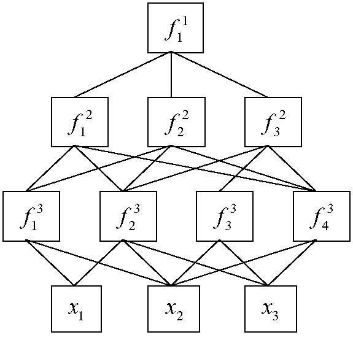
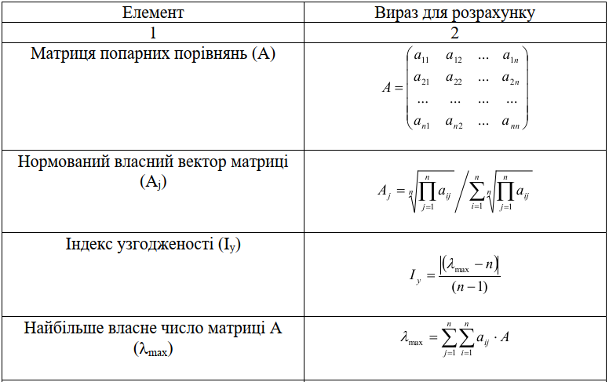
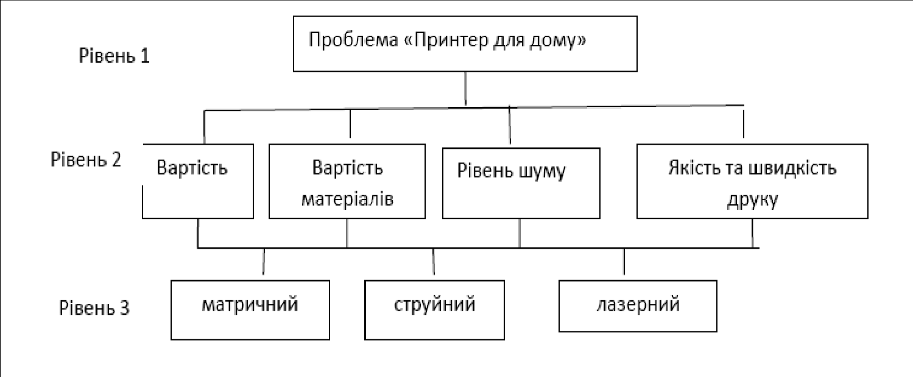

# Практична робота № 2.4

# ПРИЙНЯТТЯ РІШЕНЬ З ВИКОРИСТАННЯМ МЕТОДУ АНАЛІЗУ ІЄРАРХІЙ

**Мета роботи** – ознайомитися з підходом щодо прийняття рішень з використанням метода аналізу ієрархій та набути навичок щодо розв'язання практичних задач з прийняття управлінських рішень за використання методу аналізу ієрархій.

**Завдання для підготовки до виконання практичної роботи:**

1. За індивідуальним варіантом побудувати модель структури ієрархій. Повинно бути розглянуто не менше 3-4 альтернатив для обрання та використано не менше 4-6 параметрів (властивостей). Зобразити ієрархію у вигляді відповідної схеми (рисунка). Варіанти завдань для виконання лабораторної роботи наведено в додатку Д.
2. Прийняти рішення стосовно використання МАІ з щодо укладання договору з одним із постачальників продукції за такими критеріями, як вартість продукції, місце розташування, надійність, інтервал та обсяги поставок.
3. Побудувати ієрархію. Варіанти завдань для виконання роботи наведено у додатку Ж.

## Короткі теоретичні відомості

### ПОБУДОВА МОДЕЛІ ПРИЙНЯТТЯ РІШЕНЬ З ВИКОРИСТАННЯМ МЕТОДУ АНАЛІЗУ ІЄРАРХІЙ

Метод аналізу ієрархій (МАІ) − це математичний інструмент системного підходу до складних проблем, пов'язаних з прийняттям рішень, запропонований американським математиком Томасом Сааті. Сутність методу полягає в тому, що він не пропонує особі, що приймає рішення (ОПР), будьякого «правильного» рішення, а дозволяє в інтерактивному режимі знайти такий його варіант (альтернативу), який щонайкраще узгоджується з розумінням суті проблеми і вимогами щодо її розв'язання [8].

**На першому етапі** прийняття рішень МАІ здійснюється побудова ієрархії (рис.4.1).

У вершині ієрархії знаходиться найбільш важливий критерій або ж ціль особи, що приймає рішення. Деяка підмножина параметрів утворює другий (за важливістю) рівень ієрархії, інша підмножина – третій і т. д. На нижньому рівні ієрархії знаходяться безпосередньо альтернативи. $f_j^i$ є елементами ієрархії критеріїв, $x_i$ – альтернативами. Верхній індекс елементів визначає рівень ієрархії, а нижній індекс – порядковий номер.

*Рисунок 4.1 – Загальна схема ієрархії*

**На другому етапі** прийняття рішень здійснюється визначення пріоритетів усіх елементів ієрархії з використанням методу попарних порівнянь.

Для установлення відносної важливості елементів ієрархії використовується шкала відношень Томаса Сааті. Дана шкала дозволяє експерту ставити у відповідність ступеням переваги одного порівнюваного об'єкта над іншим деяке число.

Для побудови кожної матриці (рис. 9.1) експерт виносить $n(n-1)/2$ суджень, де $n$ – порядок матриці попарних порівнянь.

Нехай $A_1,A_2,\ldots,A_n$ – множина з $n$ елементів (альтернатив), $\mu_1,\mu_2,\ldots\mu_n$ – відповідно їх ваги або інтенсивності. Матриця попарних порівнянь (рис.9.2) має властивість зворотної симетрії відносно головної діагоналі, тобто $\mu_{ij}=1/\mu_{ij}$.

$$
\mu=\begin{pmatrix}\mu_1/\mu_1&\mu_1/\mu_2&\cdots&\mu_1/\mu_3\\\mu_1/\mu_2&\mu_2/\mu_2&\cdots&\mu_2/\mu_3\\\cdots&\cdots&\cdots&\cdots\\\mu_n/\mu_1&\mu_n/\mu_1&\cdots&\mu_n/\mu_3\end{pmatrix}.
$$

*Рисунок 4.2 – Матриця попарних порівнянь*

У результаті обробки матриць попарних порівнянь визначається множина векторів пріоритетів параметрів. Спочатку оцінюються елементи верхнього рівня ієрархії, в останню чергу оцінюються безпосередньо альтернативи.

Заповнення квадратних матриць попарних порівнянь відбувається за таким правилом. Якщо елемент Е1 домінує над елементом Е2, то комірка матриці, що відповідає рядку Е1 і стовпчику Е2, містить ціле число, а комірка матриці, що відповідає рядку Е2 і стовпчику Е1, містить обернене до нього число. Якщо елемент Е2 домінує над елементом Е1, то ціле число містить комірка, що відповідає рядку Е2 і стовпчику Е1, а дробове – комірка, що відповідає рядку Е1 і стовпчику Е2. Якщо елементи є рівнозначними, то в симетричних комірках матриці міститься число 1.

Під час заповнення матриці попарних порівнянь критеріїв експерти відповідають на питання про те, який із критеріїв є важливішим; для порівняння альтернатив за певним критерієм експерти відповідають на питання про те, яка з альтернатив є кращою або більш ймовірною відповідно для цього критерію.

Після побудови ієрархії встановлюється метод порівняння її елементів. Далі будується множина матриць попарних порівнянь. Для цього в ієрархії виділяються елементи двох типів: «батьки» і «нащадки». Елементи «нащадки» впливають на відповідні елементи вищого рівня ієрархії, які є для них «батьками». Попарні порівняння проводяться в термінах домінування одного елемента над іншим. Одержані судження подаються в цілих числах за дев'ятибальною шкалою.

**На третьому етапі** здійснюється власне ієрархічний синтез, що полягає в послідовному визначенні векторів пріоритетів альтернатив щодо критеріїв $f_j^i$, які знаходяться на всіх ієрархічних рівнях, крім передостаннього, що містить критерії $f_j^S$. Обчислення векторів пріоритетів проводиться в напрямку від нижніх рівнів до верхнього з урахуванням конкретних зв'язків між критеріями, що належать різним рівням. Обчислення проводиться шляхом множення відповідних векторів і матриць.

### МАІ ДЛЯ ПРИЙНЯТТЯ РІШЕНЬ

МАІ [1–5] надає можливість виконати декомпозицію процесу експертного оцінювання на прості складові. Метод дозволяє визначити відносну значущість альтернатив за ієрархічною системою критеріїв. Результат подається у вигляді вектору пріоритетів альтернатив, елементи якого оцінюються за шкалою відношень.

За характером зв'язків між критеріями й альтернативами визначається два типи ієрархій. До першого типу належать ті, в яких кожен критерій, що має зв'язок з альтернативами, пов'язаний з усіма розглянутими альтернативами (тип ієрархій з однаковим числом і функціональним складом альтернатив). До другого типу ієрархій належать ті, в яких кожен критерій, що має зв'язок з альтернативами, пов'язаний з декількома альтернативами, але не обов'язково з усіма (тип ієрархій з різним числом і функціональним складом альтернатив). Попарне порівняння альтернатив розглядає ієрархію з однаковим числом і функціональним складом альтернатив. Для визначення значущості елементів ієрархії використовується шкала відношень (табл. 4.1).

| Ступінь значущості (бали) | Ступінь значущості (вербальне подання) | Пояснення |
|---|---|---|
| 1 | 2 | 3 |
| 1 | однаковий | обидва критерії рівнозначні для досягнення мети |
| 3 | слабкий | існують недостатньо переконливі докази |
| 5 | поміркований | є докази того, що один критерій має перевагу над іншим |
| 7 | значний | є переконливі докази того, що один критерій має перевагу над іншим |
| 9 | абсолютний | є незаперечні докази того, що один критерій має перевагу над іншим |
| 2,4,6,8 | проміжні значення між сусідніми судженнями | ситуація, коли необхідне компромісне рішення |

*Таблиця 4.1– Шкала відношень (ступеня значущості критеріїв)*

За порівняння двох критеріїв кожен із них одержує певну кількість балів за шкалою відносної значущості (табл.10.2).

<table>
<thead>
<tr><th rowspan="2">Ступінь значущості</th><th colspan="2">Бали</th></tr>
<tr><th>Вищий</th><th>Нижчий</th></tr>
</thead>
<tbody>
<tr><td>однаковий</td><td>1</td><td>1</td></tr>
<tr><td>слабкий</td><td>3</td><td>1/3</td></tr>
<tr><td>поміркований</td><td>5</td><td>1/5</td></tr>
<tr><td>значний</td><td>7</td><td>1/7</td></tr>
<tr><td>абсолютний</td><td>9</td><td>1/9</td></tr>
</tbody>
</table>

*Таблиця 4.2 – Шкала відносної значущості*

Якщо є сумніви, наприклад, помірковано перевага або сильна перевага, то можна обирати проміжні бали (у даному випадку 4 або 1/4). За цією шкалою експерт, порівнюючи вплив двох критеріїв або альтернатив для досягнення мети, розташованої на верхньому рівні ієрархії, повинен поставити у відповідність цьому порівнянню число в інтервалі від 1 до 9 або обернене до нього.

Для оцінки однорідності суджень проводиться ранжирування елементів. Ранжирування елементів, які аналізуються з використанням матриці попарних порівнянь, здійснюється на підставі аналізу головних власних векторів матриці попарних порівнянь.

Обчислення головного власного вектора W додатної квадратної матриці А проводиться на підставі рівності

$$
AW=\lambda_{\max}W,
$$

де $\lambda_{\max}$ – максимальне власне число матриці А.

Однорідність суджень оцінюється індексом однорідності (ІО) або відношенням однорідності (ВО) за допомогою таблиці (табл. 4.3), в якій M(Iо) – середнє значення (математичне сподівання) індексу однорідності випадково складеної матриці попарних порівнянь, що базується на експериментальних даних.

| Порядок матриці | M(Iо)(ΤΙу) | Порядок матриці | M(Iо)(ΤΙу) | Порядок матриці | M(Iо)(ΤΙу) |
|---|---|---|---|---|---|
| 1 | 0,00 | 6 | 1,24 | 11 | 1,51 |
| 2 | 0,00 | 7 | 1,32 | 12 | 1,48 |
| 3 | 0,58 | 8 | 1,41 | 13 | 1,56 |
| 4 | 0,90 | 9 | 1,45 | 14 | 1,57 |
| 5 | 1,12 | 10 | 1,49 | 15 | 1,59 |

*Таблиця 4.3 – Середнє значення ІО суджень M(Iо) або індекс узгодженості*

Значення ВО повинно бути меншим або дорівнювати 0,1. Якщо для матриці попарних порівнянь ВО>0,1, то це свідчить про порушення логічності та узгодженості суджень експерта під час складання матриць попарних порівнянь.

Для визначення ваги власних векторів матриць попарних порівнянь альтернатив за вагами критеріїв (елементів), що знаходяться в ієрархії, а також для обчислення суми за всіма зваженими компонентами власних векторів нижчого рівня ієрархії використовується ієрархічний синтез.

Алгоритм ієрархічного синтезу передбачає виконання наступних кроків.

*Крок* 1. Визначення векторів пріоритетів альтернатив $W_{f_j^i}^x$ щодо елементів $f_i^j$ передостаннього рівня ієрархії ($i=S$). Через $f_i^j$ позначаються елементи ієрархії. Верхній індекс в даному позначенні вказує на рівень ієрархії, нижній індекс – на порядковий номер елемента відповідного рівня. Обчислення множини векторів пріоритетів альтернатив $W_S^x$ щодо рівня ієрархії $S$ здійснюється за ітераційним алгоритмом, в результаті чого визначається множина векторів

$$
W_S^x=\left\{W_{f_1^S}^x,W_{f_2^S}^x,\ldots,W_{f_p^S}^x\right\}.
$$

*Крок* 2. Аналогічно обробляються матриці попарних порівнянь $f_i^j$. Внаслідок обробки матриць попарних порівнянь визначається множина векторів пріоритетів критеріїв $W^f=\left\{W_{f_i^j}^f\right\}$.

Отримані значення векторів використовуються для визначення векторів пріоритетів альтернатив щодо всіх елементів ієрархії.

*Крок* 3. Виконується послідовне визначення векторів пріоритетів альтернатив щодо критеріїв $f_i^j$, які знаходяться на всіх ієрархічних рівнях, крім передостаннього, що містить критерій $f_i^S$. Обчислення векторів пріоритетів проводиться в напрямку від нижніх рівнів до верхнього з урахуванням зв'язків, що належать різним рівням, шляхом множення відповідних векторів і матриць.

Вираз для обчислення векторів пріоритетів альтернатив визначається таким чином:

$$
W_{f_j^i}^x=\left[W_{f_1^{i-1}}^x,W_{f_2^{i-1}}^x,\ldots,W_{f_n^{i-1}}^x\right]\cdot W_{f_j^{i-1}}^f,
$$

де $W_{f_j^i}^x$ – вектор пріоритетів альтернатив щодо критерію $W_{f_j^{i-1}}^x$, який визначає $j$-й стовпчик матриці;

$W_{f_j^i}^f$ – вектор пріоритетів критеріїв $f_1^{i-1},f_2^{i-1},\ldots,f_n^{i-1}$, пов'язаних з критерієм $f_j$ вищого рівня ієрархії.

Після розв'язання задачі ієрархічного синтезу оцінюється однорідність всієї ієрархії, для чого підсумовуються показники однорідності всіх рівнів ієрархії відносно першого, найвищого, рівня. Число кроків алгоритму обчислення однорідності ієрархії визначається конкретною ієрархією.

Для агрегації думок декількох експертів береться середнє геометричне, що обчислюється за таким співвідношенням:

$$
a_{ij}^A=\sqrt[n]{a_{ij}^1\ldots a_{ij}^n},
$$

де $a_{ij}^A$ – агрегована оцінка елемента, що належить $i$-му рядку $j$-го стовпчика матриці попарних порівнянь;

$n$ – число матриць попарних порівнянь, кожна з яких складена одним і тим самим експертом.

Осереднення може здійснюватися на рівні власних векторів матриць попарних порівнянь.

У табл. 4.4 наведено основні формули для проведення обчислень методом попарних порівнянь.

| Елемент | Вираз для розрахунку |
|---|---|
| 1 | 2 |
| Матриця попарних порівнянь (А) | $A=\begin{pmatrix}a_{11}&a_{12}&\cdots&a_{1n}\\a_{21}&a_{22}&\cdots&a_{2n}\\\cdots&\cdots&\cdots&\cdots\\a_{n1}&a_{n2}&\cdots&a_{nn}\end{pmatrix}$ |
| Нормований власний вектор матриці (Aj) | $A_j=\sqrt[n]{\prod_{j=1}^{n}a_{ij}}\Big/\sum_{i=1}^{n}\sqrt[n]{\prod_{j=1}^{n}a_{ij}}$ |
| Індекс узгодженості (Iy) | $I_y=\dfrac{\left|(\lambda_{\max}-n)\right|}{(n-1)}$ |
| Найбільше власне число матриці А (λmax) | $\lambda_{\max}=\sum_{j=1}^{n}\sum_{i=1}^{n}a_{ij}\cdot A$ |
| Матриця попарних порівнянь альтернатив за встановленими критеріями (Bk) | $B_n=\begin{pmatrix}b^k{}_{11}&b^k{}_{12}&\cdots&b^k{}_{1m}\\b^k{}_{21}&b^k{}_{22}&\cdots&b^k{}_{2m}\\\cdots&\cdots&\cdots&\cdots\\b^k{}_{m1}&b^k{}_{m2}&\cdots&b^k{}_{mm}\end{pmatrix}$ |
| Нормовані власні вектори матриць BK ($B_i^k$) | $B_i^k=\sqrt[m]{\prod_{j=1}^{m}b^k{}_{ij}}\Big/\sum_{i=1}^{n}\sqrt[m]{\prod_{j=1}^{m}b^k{}_{ij}}$ |
| Глобальні пріоритети | $G_n=\sum_{i=1}^{n}A\cdot B_n^i$ |

*Таблиця 4.4 – Формули для проведення обчислень методом попарних порівнянь*

## 2. ПОРЯДОК ВИКОНАННЯ ПРАКТИЧНОЇ РОБОТИ

Розглянемо порядок виконання лабораторної роботи на прикладі розв'язання конкретної задачі.

**Задача 1.** Прийняти рішення щодо обрання принтера для домашнього використання. Визначити оптимальне за заданими критеріями рішення щодо обрання принтера, використовуючи МАІ. Варіант вважається обраним, якщо визначено тип принтера (матричний, струйний або лазерний).

Обґрунтувати одержаний результат щодо обрання альтернативи.

1. Виконати перший крок, який полягає в декомпозиції задачі та поданні її у вигляді ієрархічної структури (рис.4.3).

*Рисунок 4.3 – Ієрархія задачі*

2. Побудувати матрицю попарних порівнянь відносної важливості критеріїв, яка має вигляд, наведений у таблиці 4.5.

| Критерії | Вартість принтера | Вартість матеріалів | Рівень шуму | Якість та швидкість друку | Вектор пріоритетів (ваги) |
|---|---|---|---|---|---|
| Вартість принтера | 1 | 4 | 2 | 1/2 | 0,26 |
| Вартість матеріалів | 1/4 | 1 | 1/3 | 1/6 | 0,06 |
| Рівень шуму | 1/2 | 3 | 1 | 1/6 | 0,13 |
| Якість та швидкість друку | 2 | 6 | 6 | 1 | 0,54 |

*Таблиця 4.5 – Матриця попарних порівнянь відносної важливості критеріїв для другого рівня ієрархії*

3. Побудувати множину матриць нижнього рівня, що відповідають оцінюванню альтернатив за обраним набором критеріїв (табл. 4.6 – 4.9).

| Альтернативи | Матричний | Струйний | Лазерний | Вектор пріоритетів (ваги) |
|---|---|---|---|---|
| Матричний | 1 | 2 | 4 | |
| Струйний | ½ | 1 | 3 | |
| Лазерний | ¼ | 1/3 | 1 | |

*Таблиця 4.6 – Матриця попарних порівнянь альтернатив за критерієм «вартість принтера»*

| Альтернативи | Матричний | Струйний | Лазерний | Вектор пріоритетів (ваги) |
|---|---|---|---|---|
| Матричний | 1 | 4 | 9 | |
| Струйний | ¼ | 1 | 2 | |
| Лазерний | 1/9 | 1/2 | 1 | |

*Таблиця 4.7 – Матриця попарних порівнянь альтернатив за критерієм «вартість матеріалів»*

| Альтернативи | Матричний | Струйний | Лазерний | Вектор пріоритетів (ваги) |
|---|---|---|---|---|
| Матричний | 1 | 1/6 | 1/8 | |
| Струйний | 6 | 1 | 1/2 | |
| Лазерний | 8 | 2 | 1 | |

*Таблиця 4.8 – Матриця попарних порівнянь альтернатив за критерієм «рівень шуму»*

| Альтернативи | Матричний | Струйний | Лазерний | Вектор пріоритетів (ваги) |
|---|---|---|---|---|
| Матричний | 1 | 1/6 | 1/9 | |
| Струйний | 6 | 1 | 1/3 | |
| Лазерний | 9 | 3 | 1 | |

*Таблиця 4.9 – Матриця попарних порівнянь альтернатив за критерієм «якість та швидкість друку»*

4. Обчислити вектори локальних пріоритетів, виконати їх нормування й остаточно заповнити табл. 4.6 –4.9.
5. Обчислити вектор глобальних пріоритетів та подати отримані результати у табличному вигляді (табл.4.10).

<table>
<thead>
<tr><th>Критерії/альтернативи</th><th>Вартість принтера</th><th>Вартість матеріалів</th><th>Рівень шуму</th><th>Якість та швидкість друк</th><th>Вектор глобальних пріоритетів</th></tr>
</thead>
<tbody>
<tr><td>Ваги другого рівня ієрархії</td><td>0,26</td><td>0,06</td><td>0,13</td><td><strong>0,54</strong></td><td></td></tr>
<tr><td>Матричний</td><td>0,56</td><td>0,74</td><td>0,06</td><td>0,06</td><td>0,23</td></tr>
<tr><td>Струйний</td><td>0,32</td><td>0,17</td><td>0,34</td><td>0,28</td><td>0,29</td></tr>
<tr><td>Лазерний</td><td>0,12</td><td>0,09</td><td>0,59</td><td>0,66</td><td><strong>0,47</strong></td></tr>
</tbody>
</table>

*Таблиця 4.10 – Вектори локальних та глобальних пріоритетів*

6 Зробити висновки. За результати розрахунків (табл. 4.10) можна дійти висновку, що ОПР прийме рішення про придбання лазерного принтера (max = 0,47), а найбільш важливим критерієм з його точки зору є якість та швидкість друку (max =0,54).

**Задача 2.** Прийняти рішення про укладання договору з одним із постачальників продукції за використання МАІ, беручи до уваги такі критерії, як вартість продукції, інтервал та обсяги поставок, місце розташування, надійність, за вихідними даним таблиці 4.11.

| | Інтервал поставок, дні | Обсяг поставок, т | Вартість, тис. грн. | Місце розташування, км | Надійність |
|---|---|---|---|---|---|
| 1 | 2 | 3 | 4 | 5 | 6 |
| Постачальник 1 | 20 | 15 | 233,09 | 75 | 99,892 |
| Постачальник 2 | 20 | 20 | 240,00 | 90 | 100,00 |
| Постачальник 3 | 20 | 90 | 294,00 | 60 | 97,407 |
| Постачальник 4 | 20 | 30 | 270,00 | 100 | 99,929 |
| Постачальник 5 | 40 | необмежена | 96, 66 | 55 | 100,00 |

*Таблиця 4.11 – Вихідні дані для розв'язання задачі щодо обрання постачальника*

1. Для прийняття рішення щодо укладання договору з одним із п'яти постачальників побудувати ієрархію, визначивши мету, критерії, альтернативи (рис. 4.3).

*Рисунок 4.3 – Ієрархія задачі щодо обрання постачальника*

2. Побудувати матриці попарних порівнянь та розрахувати значення елементів нормованого власного вектора для групи критеріїв (табл. 4.12).
3. Оцінити рівень узгодженості думок експертів, спираючись на таблицю ІО або індексів узгодженості (табл. 4.3).

$$
\lambda_{\max}=(20{,}33\cdot0{,}0519)+(27\cdot0{,}0297)+(9{,}3667\cdot1{,}433)+\\+(4{,}6250\cdot0{,}2706)+(1{,}7694\cdot0{,}5044)=5{,}3458;
$$
$$
I_y=\left|(5{,}3458-5)/(5-1)\right|=0{,}08645;
$$
$$
B_y=0{,}08645/1{,}12=0{,}0772(7{,}72\%).
$$

| Критерії | Інтервал поставок, днів | Обсяг поставок, т | Вартість, тис. грн | Місце розташування, км | Надійність | $\sqrt[5]{\prod_{j=1}^{5}a_j}$ | Нормовані оцінки вектора пріоритету, Ai |
|---|---|---|---|---|---|---|---|
| Інтервал поставок | 1 | 3 | 1/5 | 1/6 | 1/8 | 0,4162 | 0,0519 |
| Обсяг поставок | 1/3 | 1 | 1/6 | 1/8 | 1/9 | 0,2384 | 0,0297 |
| Вартість | 5 | 6 | 1 | 1/3 | 1/5 | 1,1487 | 0,1433 |
| Місце розташування | 6 | 8 | 3 | 1 | 1/3 | 2,1689 | 0,2706 |
| Надійність | 8 | 9 | 5 | | | 4,0428 | 0,5044 |
| Сума | 20,333 | 27 | 9,3668 | 4,6250 | 1,7694 | | |

*Таблиця 4.12 – Матриця попарних порівнянь значущості критеріїв з власним вектором для групи критеріїв*

4. Виконати обчислення вектора пріоритету кожної з альтернатив (постачальників) за критерієм «інтервал поставок» (табл. 4.13).

| Альтернативи | Постачальник 1 | Постачальник 2 | Постачальник 3 | Постачальник 4 | Постачальник 5 | $\sqrt[5]{\prod_{j=1}^{5}a_j}$ | Нормовані оцінки вектора пріоритету, Ai |
|---|---|---|---|---|---|---|---|
| Постачальник 1 | 1 | 1 | 1 | 1 | 1/9 | 0,6463 | 0,0769 |
| Постачальник 2 | 1 | 1 | 1 | 1 | 1/9 | 0,6463 | 0,0769 |
| Постачальник 3 | 1 | 1 | 1 | 1 | 1/9 | 0,6463 | 0,0769 |
| Постачальник 4 | 1 | 1 | 1 | 1 | 1/9 | 0,6463 | 0,0769 |
| Постачальник 5 | 9 | 9 | 9 | 9 | 1 | 5,7995 | 0,6923 |
| Сума | 13 | 13 | 13 | 13 | 1,444 | 8,3771 | |

*Таблиця 4.13 – Обчислення вектора пріоритету альтернатив за критерієм за критерієм «інтервал поставок»*

За цим критерієм найвищий пріоритет має постачальник 5.

5. Аналогічно визначити вектори пріоритетів для кожної з альтернатив (Bу ≤10 %) за іншими критеріями.
6. Виконати обчислення елементів вектора глобального пріоритету (табл. 4.14) та зробити висновки.

Виходячи з одержаних значень вектора глобальних пріоритету можна говорити по те, що постачальник 5 з пріоритетом 0,4396 є абсолютним лідером змагання щодо укладання з ним договору про постачання продукції.

<table>
<thead>
<tr><th rowspan="3">Альтернативи</th><th colspan="5">Критерії</th><th rowspan="3">Глобальні пріоритети</th></tr>
<tr><th>Інтервал поставок</th><th>Обсяг поставок</th><th>Вартість поставок</th><th>Місце розта­шування</th><th>Надійність</th></tr>
<tr><th colspan="5">Числові значення вектора пріоритетів</th></tr>
</thead>
<tbody>
<tr><td><strong>0, 0519</strong></td><td><strong>0,0297</strong></td><td><strong>0,1433</strong></td><td><strong>0,2706</strong></td><td><strong>0,5044</strong></td><td></td></tr>
<tr><td>Постачальник 1</td><td>0,0769</td><td>0,0389</td><td>0,1212</td><td>0,2441</td><td>0,1588</td><td>0,1687</td></tr>
<tr><td>Постачальник 2</td><td>0,0769</td><td>0,0537</td><td>0,1212</td><td>0,0876</td><td>0,3637</td><td>0,2301</td></tr>
<tr><td>Постачальник 3</td><td>0,0769</td><td>0,1981</td><td>0,0451</td><td>0,2304</td><td>0,0753</td><td>0,1166</td></tr>
<tr><td>Постачальник 4</td><td>0,0769</td><td>0,0957</td><td>0,0718</td><td>0,0308</td><td>0,0383</td><td>0,0448</td></tr>
<tr><td>Постачальник 5</td><td>0,6923</td><td>0,6153</td><td>0,6405</td><td>0,4068</td><td>0,3637</td><td>0,4396</td></tr>
</tbody>
</table>

*Таблиця 4.14 – Обчислення вектора глобального пріоритету*

## Контрольні запитання

1. Якою є основна ідея МАІ?
2. Яким чином формується матриця попарних порівнянь (МПП)?
3. В чому полягає особливість шкали порівнянь, яка застосовується в МАІ?
4. За якими формулами визначаються елементи векторів локальних та глобальних пріоритетів?
5. За якими принципами відбувається остаточне обрання альтернатив?
6. У чому полягає МАІ?
7. Як за використанням МАІ здійснюється аналіз однорідності суджень?
8. У чому полягає алгоритм ієрархічного синтезу?
9. Як за використанням МАІ відбувається агрегування думок експертів?
10. Як створюється матриця попарних порівнянь?
11. Як обчислюється найбільше власне число матриці?
